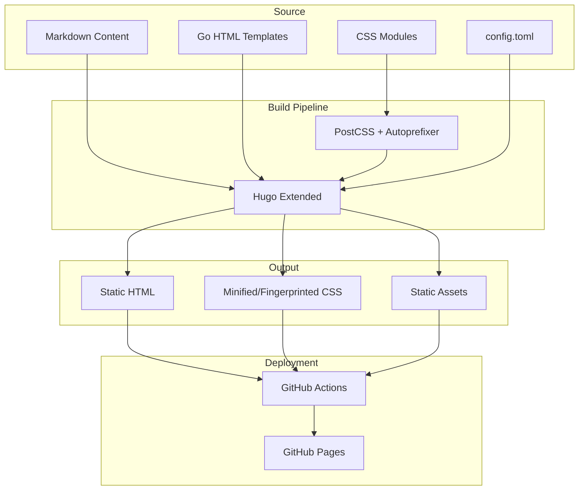
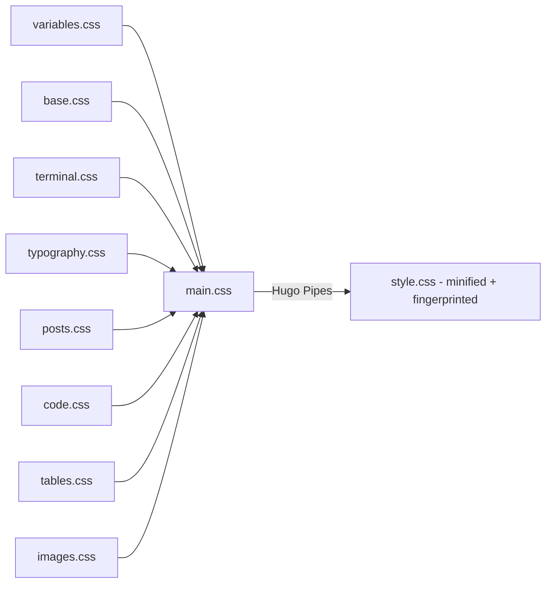

# Architecture

## System Architecture

This is a Hugo-based static site with a custom inline terminal-style theme. There is no backend — the site is
pre-rendered at build time and served as static HTML/CSS from GitHub Pages.

## Design Patterns

### Terminal UI Metaphor

The site uses a hybrid terminal aesthetic: Linear-inspired clean layout with terminal texture (monospace font, nav prompts, phosphor glow). Key elements:

- Site header with title and nav links styled as `~/home`, `~/tags`
- Footer with terminal prompt: `visitor@abrahamsustaita.com:~$`
- Phosphor glow effect on h1 headings and site title
- 13-theme switcher with localStorage persistence
- Images wrapped in terminal-style frames with window buttons

### Theme System

13 themes ported from dotfiles ecosystem, switchable via dropdown:

- **Default:** rose-pine (Rosé Pine Moon)
- **Catppuccin:** mocha, frappe
- **Custom:** prism, crystals, tron-ares, enterprise-desert, ai-machine, ai-flower, aurora, headphones, fantasy-autumn, color-wall

Themes use `data-theme` attribute on `<html>` with CSS custom property overrides. A blocking inline script in `<head>` reads localStorage and sets the theme before first paint to prevent FOUC.

### Modular CSS Architecture

CSS is split into single-responsibility modules, concatenated and fingerprinted by Hugo Pipes:

### Color System

Uses CSS custom properties defined in `variables.css`. Default theme is Rosé Pine Moon in `:root`, with 12 additional `[data-theme]` blocks for theme switching:

| Variable | Default (rose-pine) | Usage |
|---|---|---|
| `--base` | `#232136` | Page background |
| `--surface` | `#2a273f` | Elevated backgrounds |
| `--overlay` | `#6e6a86` | Borders, highlights |
| `--text` | `#e0def4` | Body text |
| `--subtle` | `#908caa` | Secondary text |
| `--muted` | `#6e6a86` | Muted text, comments |
| `--love` | `#eb6f92` | Errors, red accent |
| `--gold` | `#f6c177` | Warnings, yellow accent |
| `--rose` | `#ea9a97` | Hover links, inline code |
| `--pine` | `#3e8fb0` | Prompts, operators |
| `--foam` | `#9ccfd8` | Links, strings |
| `--iris` | `#c4a7e7` | Headings, keywords |

### Responsive Design

Three breakpoints with mobile-first adjustments:

- `max-width: 768px` — mobile (stacked header, reduced padding, smaller fonts)
- Default — standard desktop
- `min-width: 1400px` — large screens (wider terminal, larger base font)
