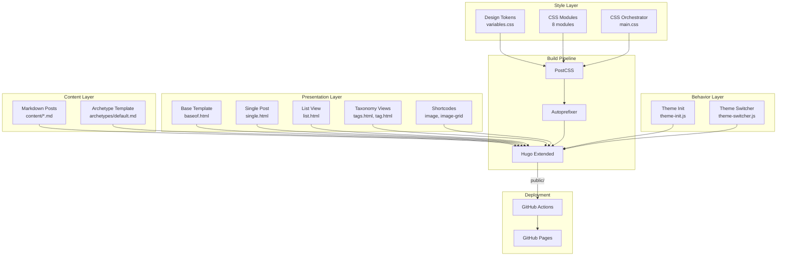
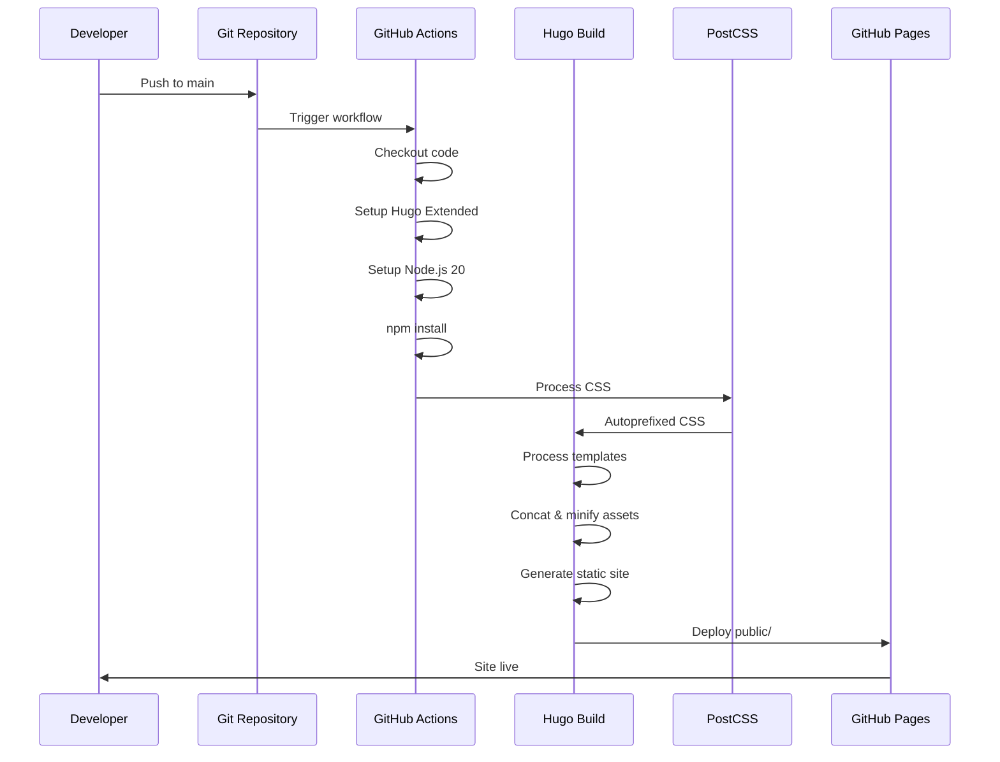
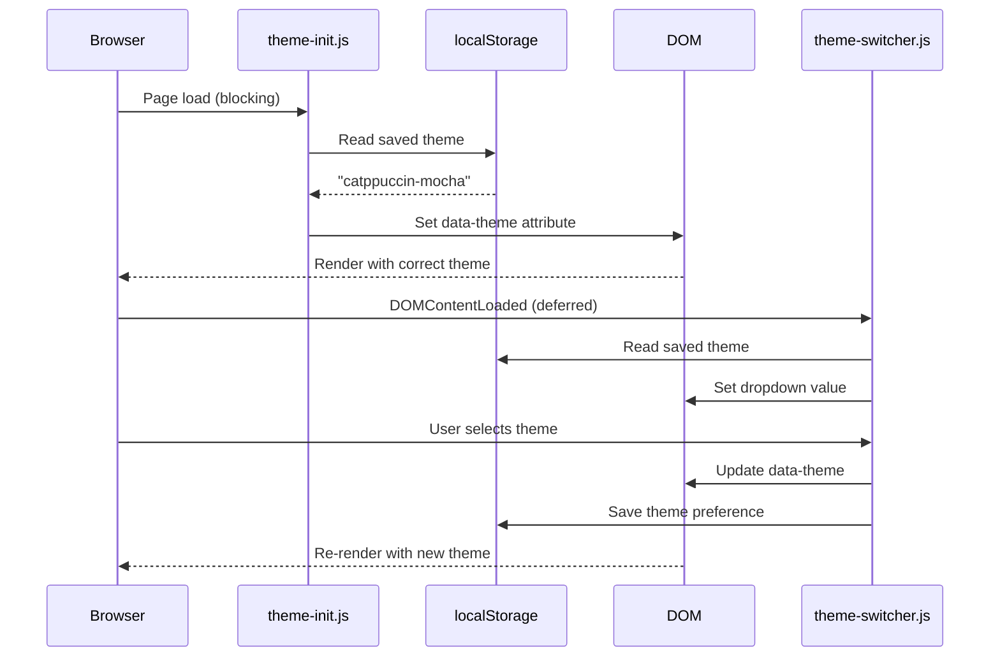

# Architecture

## System Overview

abrahamsustaita.com is a static site generator-based technical blog built with Hugo Extended. The architecture follows a **template-driven static generation** pattern where Markdown content is transformed into HTML through Go templates, styled with modular CSS, and enhanced with minimal JavaScript for theme switching.

## Architectural Diagram



## Design Patterns

### 1. Template Inheritance Pattern

Hugo's block/define system enables template composition:

```text
baseof.html (root)
├── defines: <head>, <header>, <footer>
├── declares: {{ block "main" . }}
│
├── single.html (implements "main" for posts)
├── list.html (implements "main" for listings)
└── index.html (implements "main" for homepage)
```

**Benefits:**

- DRY principle: shared structure defined once
- Consistent header/footer across all pages
- Easy to add new page types

### 2. Modular CSS Architecture

CSS is organized by concern, not by page:

```text
variables.css  → Design tokens (13 theme palettes)
base.css       → Reset & foundational styles
terminal.css   → Terminal UI components
typography.css → Text styling
posts.css      → Post-specific layouts
code.css       → Syntax highlighting
tables.css     → Table formatting
images.css     → Image & grid components
```

**Benefits:**

- Single Responsibility Principle per module
- Easy to locate and modify specific concerns
- Hugo Pipes handles concatenation automatically

### 3. Design Token System

All colors use CSS custom properties:

```css
/* variables.css defines tokens */
:root[data-theme="rose-pine"] {
  --base: #1e1e2b;
  --text: #e0def4;
  --iris: #c4a7e7;
}

/* Other modules consume tokens */
body { background: var(--base); color: var(--text); }
h1 { color: var(--iris); }
```

**Benefits:**

- Theme switching via single attribute change
- No raw hex values in component CSS
- Consistent color usage across site

### 4. Progressive Enhancement

JavaScript is optional and non-blocking:

- **Theme Init:** Blocking script prevents FOUC (Flash of Unstyled Content)
- **Theme Switcher:** Deferred script for dropdown interaction
- **Graceful Degradation:** Site fully functional without JS (defaults to Rosé Pine)

### 5. Asset Pipeline Pattern

Hugo Pipes orchestrates asset processing:

```text
Source Assets → Hugo Pipes → Optimized Output
├── CSS modules → Concat → Minify → Fingerprint → style.[hash].css
└── JS modules  → Minify → Fingerprint → script.[hash].js
```

**Benefits:**

- No manual build scripts
- Automatic cache busting via fingerprinting
- Subresource Integrity (SRI) hashes for security

## Architectural Layers

### Content Layer

**Responsibility:** Store and structure blog content

- **Format:** Markdown with YAML front matter
- **Organization:** Flat file structure in `content/`
- **Naming:** `topic.sequence.subtitle.md`
- **Metadata:** `title`, `date`, `draft`, `tags`

### Presentation Layer

**Responsibility:** Transform content into HTML

- **Base Template:** `baseof.html` defines site structure
- **View Templates:** `single.html`, `list.html`, `index.html`
- **Taxonomy Templates:** `tags.html`, `tag.html`
- **Shortcodes:** Reusable content components (`image`, `image-grid`)

### Style Layer

**Responsibility:** Visual presentation and theming

- **Design Tokens:** `variables.css` (13 theme palettes)
- **Component Styles:** 7 modular CSS files
- **Orchestration:** `main.css` imports all modules
- **Processing:** PostCSS + Autoprefixer

### Behavior Layer

**Responsibility:** Client-side interactivity

- **Theme Initialization:** Prevent FOUC, restore saved theme
- **Theme Switching:** Handle dropdown selection, persist to localStorage

### Build Layer

**Responsibility:** Transform source to production assets

- **Hugo Extended:** Template processing, asset pipeline
- **PostCSS:** CSS processing and vendor prefixing
- **Minification:** CSS and JS compression
- **Fingerprinting:** Cache-busting hashes

### Deployment Layer

**Responsibility:** Publish site to production

- **CI/CD:** GitHub Actions workflow
- **Hosting:** GitHub Pages
- **Trigger:** Push to `main` branch

## Data Flow

### Build-Time Flow



### Runtime Flow (Theme Switching)



## Architectural Decisions

### Decision 1: Flat Content Structure

**Choice:** All posts in `content/` root, no subdirectories

**Rationale:**

- Simple mental model for small blog
- No need for section-based organization yet
- Naming convention (`topic.sequence.subtitle`) provides structure

**Trade-offs:**

- ✅ Easy to find files
- ✅ Simple Hugo configuration
- ❌ May need refactoring if content grows significantly

### Decision 2: CSS Custom Properties for Theming

**Choice:** Use CSS variables instead of SCSS variables or CSS-in-JS

**Rationale:**

- Runtime theme switching without page reload
- No build step for theme changes
- Native browser support

**Trade-offs:**

- ✅ Dynamic theme switching
- ✅ No JavaScript required for styling
- ❌ Limited IE11 support (acceptable for technical blog)

### Decision 3: Minimal JavaScript

**Choice:** Vanilla JS for theme management only

**Rationale:**

- No framework overhead for simple use case
- Fast page loads
- Progressive enhancement

**Trade-offs:**

- ✅ Tiny bundle size (~1KB total)
- ✅ No build complexity
- ❌ Manual DOM manipulation (acceptable for small scope)

### Decision 4: Hugo Pipes Over External Build Tools

**Choice:** Use Hugo's built-in asset pipeline instead of Webpack/Vite

**Rationale:**

- Single tool for entire build process
- No separate build configuration
- Hugo Extended includes SCSS/PostCSS support

**Trade-offs:**

- ✅ Simplified toolchain
- ✅ Faster builds
- ❌ Less flexibility than dedicated bundlers (not needed here)

### Decision 5: Direct Commits to Main

**Choice:** No feature branches for this single-contributor project

**Rationale:**

- Reduces overhead for personal project
- Immediate deployment on push
- No PR review process needed

**Trade-offs:**

- ✅ Faster iteration
- ✅ Simpler workflow
- ❌ No safety net (acceptable for personal blog)

## Scalability Considerations

### Current Scale

- 4 blog posts
- 9 templates
- 9 CSS modules
- 2 JS files
- Build time: ~1 second

### Growth Scenarios

**Scenario 1: 100+ Blog Posts**

- Current flat structure may become unwieldy
- Consider organizing by year or topic subdirectories
- Hugo's fast build times should handle this scale

**Scenario 2: Multiple Content Types**

- Add new sections (e.g., `/projects`, `/talks`)
- Create section-specific templates
- Extend taxonomy system

**Scenario 3: Interactive Features**

- Consider adding comments (Utterances/Giscus)
- Add search functionality (Lunr.js or Algolia)
- May need more JavaScript

**Scenario 4: Multi-Author**

- Add author taxonomy
- Implement author pages
- Add author metadata to front matter

## Security Considerations

### Build-Time Security

- **Dependency Scanning:** npm audit for PostCSS dependencies
- **Minimal Dependencies:** Only 3 dev dependencies reduces attack surface
- **Subresource Integrity:** Hugo generates SRI hashes for assets

### Runtime Security

- **Static Site:** No server-side code, no database
- **Content Security Policy:** Could add CSP headers via GitHub Pages config
- **HTTPS:** Enforced by GitHub Pages

### Deployment Security

- **GitHub Actions:** Uses official actions from trusted publishers
- **Secrets Management:** GitHub token automatically provided
- **Branch Protection:** Could enable for `main` branch

## Performance Characteristics

### Build Performance

- **Cold Build:** ~1 second for 4 posts
- **Incremental Build:** ~100ms with Hugo server
- **Asset Processing:** PostCSS adds ~200ms

### Runtime Performance

- **Page Weight:** ~50KB HTML + ~10KB CSS + ~1KB JS
- **First Contentful Paint:** <1 second
- **Time to Interactive:** <1.5 seconds
- **Lighthouse Score:** 95+ (estimated)

### Optimization Techniques

- **Minification:** CSS and JS minified by Hugo
- **Fingerprinting:** Cache-busting for long-term caching
- **Lazy Loading:** Images use `loading="lazy"` attribute
- **Deferred JS:** Theme switcher loads with `defer`

## Maintenance Considerations

### Update Frequency

- **Hugo:** Check for updates quarterly
- **PostCSS Dependencies:** Update via `npm update` monthly
- **GitHub Actions:** Actions auto-update to latest minor versions

### Monitoring

- **Build Status:** GitHub Actions provides build logs
- **Deployment Status:** GitHub Pages deployment status
- **Analytics:** Could add privacy-friendly analytics (Plausible/Fathom)

### Backup Strategy

- **Source Code:** Git repository on GitHub
- **Generated Site:** Reproducible from source
- **No Database:** No data to back up
