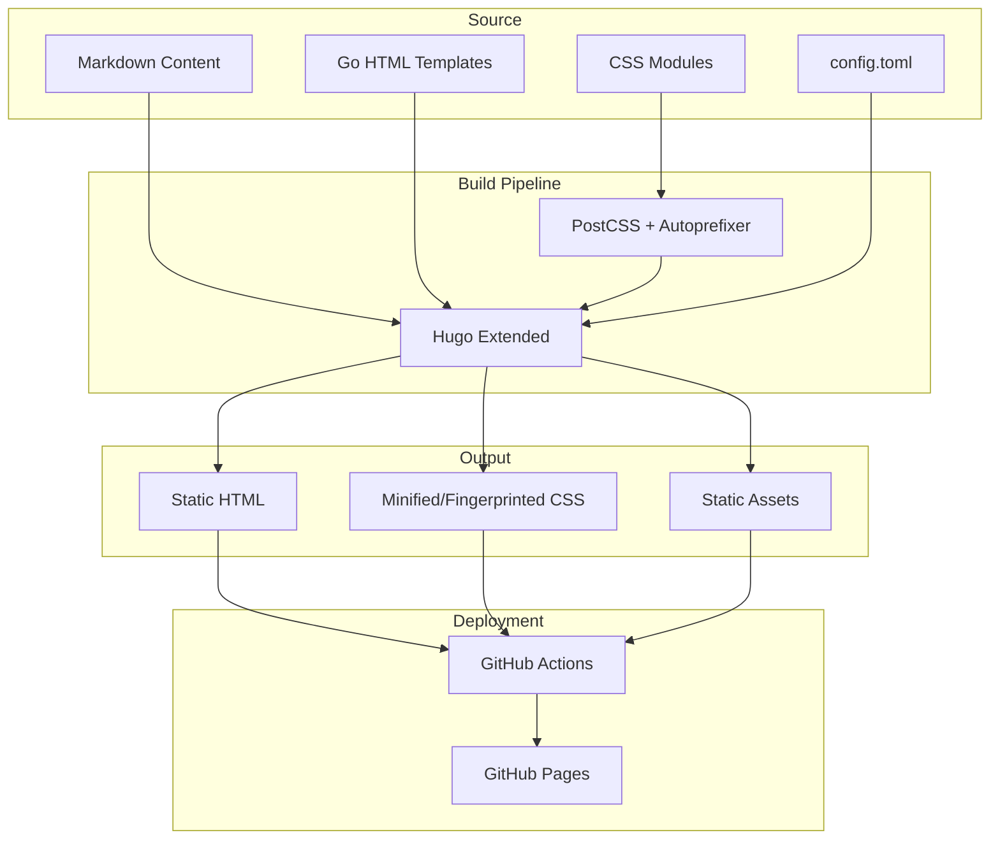
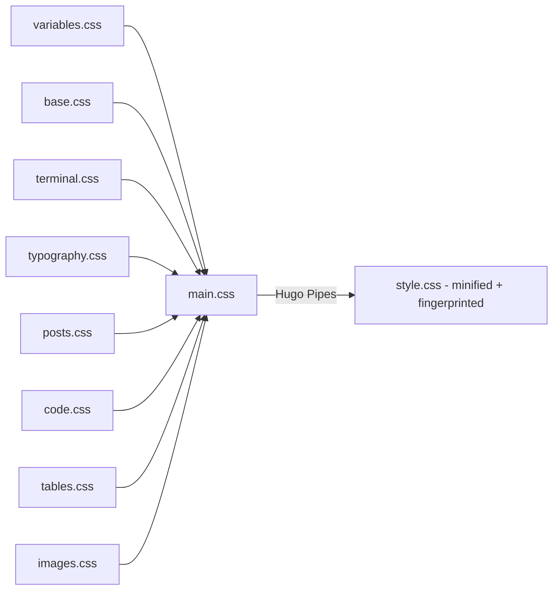

# Architecture

## System Architecture

This is a Hugo-based static site with a custom inline terminal-style theme. There is no backend — the site is
pre-rendered at build time and served as static HTML/CSS from GitHub Pages.

## Design Patterns

### Terminal UI Metaphor

The entire site is styled to look like a terminal window:

- A window chrome header with close/minimize/maximize buttons
- A blinking cursor animation
- Command-line prompts (`me@abrahamsustaita.com:~$`) before page titles
- `cat filename.md` for single posts, `ls section/` for list pages
- Images wrapped in terminal-style frames with window buttons

### Modular CSS Architecture

CSS is split into single-responsibility modules, concatenated and fingerprinted by Hugo Pipes:

### Color System

Uses the Rosé Pine Moon palette defined as CSS custom properties in `variables.css`:

| Variable | Hex | Usage |
|---|---|---|
| `--base` | `#232136` | Page background |
| `--surface` | `#2a273f` | Terminal container |
| `--overlay` | `#393552` | Borders, highlights |
| `--text` | `#e0def4` | Body text |
| `--subtle` | `#908caa` | Secondary text |
| `--muted` | `#6e6a86` | Muted text, comments |
| `--love` | `#eb6f92` | Close button, errors |
| `--gold` | `#f6c177` | Minimize button, types |
| `--rose` | `#ea9a97` | Hover links, inline code |
| `--pine` | `#3e8fb0` | Prompts, operators |
| `--foam` | `#9ccfd8` | Links, maximize button |
| `--iris` | `#c4a7e7` | Headings, keywords |

### Responsive Design

Three breakpoints with mobile-first adjustments:

- `max-width: 768px` — mobile (reduced padding, smaller fonts)
- Default — standard desktop
- `min-width: 1400px` — large screens (wider terminal, larger base font)
