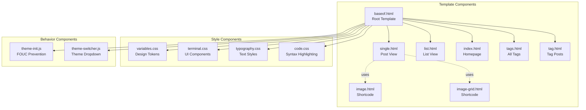
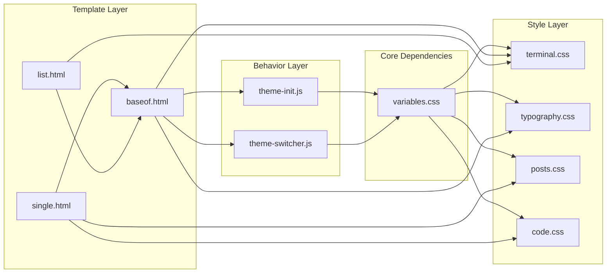

# Components

## Component Overview

The abrahamsustaita.com codebase consists of three primary component categories:

1. **Template Components** - Hugo templates that generate HTML
2. **Style Components** - CSS modules that define visual presentation
3. **Behavior Components** - JavaScript modules that add interactivity

## Component Hierarchy



## Template Components

### baseof.html

**Purpose:** Root template that defines the site structure and asset pipeline

**Responsibilities:**

- Define HTML document structure
- Load and concatenate CSS modules
- Load and execute JavaScript modules
- Define site header with navigation and theme selector
- Define site footer
- Provide `{{ block "main" . }}` placeholder for child templates

**Key Features:**

- **Asset Pipeline:** Concatenates 8 CSS modules via `resources.Concat`
- **Fingerprinting:** Generates cache-busting hashes for CSS and JS
- **SRI Hashes:** Includes Subresource Integrity for security
- **Blocking Script:** Loads `theme-init.js` inline to prevent FOUC
- **Deferred Script:** Loads `theme-switcher.js` with `defer` attribute

**Template Structure:**

```html
<!DOCTYPE html>
<html>
<head>
  <!-- Blocking theme init -->
  <script>{{ $themeInit.Content | safeJS }}</script>
  
  <!-- CSS pipeline -->
  {{ $css := slice $variables $base ... | resources.Concat | minify | fingerprint }}
  <link rel="stylesheet" href="{{ $css.RelPermalink }}" integrity="{{ $css.Data.Integrity }}">
  
  <!-- Deferred theme switcher -->
  <script src="{{ $themeSwitcher.RelPermalink }}" defer></script>
</head>
<body>
  <header><!-- Navigation & theme selector --></header>
  {{ block "main" . }}{{ end }}
  <footer><!-- Copyright & links --></footer>
</body>
</html>
```

**Dependencies:**

- All CSS modules in `assets/css/`
- All JS modules in `assets/js/`

### single.html

**Purpose:** Template for individual blog post pages

**Responsibilities:**

- Display post title, date, and tags
- Render post content from Markdown
- Show terminal prompt pattern: `me@abrahamsustaita.com:~$ cat post-name.md`

**Template Structure:**

```html
{{ define "main" }}
<article class="post">
  <div class="terminal-prompt">me@abrahamsustaita.com:~$ cat {{ .File.BaseFileName }}.md</div>
  <h1>{{ .Title }}</h1>
  <div class="post-meta">
    <time>{{ .Date.Format "2006-01-02" }}</time>
    {{ with .Params.tags }}
      <span class="tags">{{ range . }}#{{ . }} {{ end }}</span>
    {{ end }}
  </div>
  <div class="post-content">
    {{ .Content }}
  </div>
</article>
{{ end }}
```

**Dependencies:**

- `baseof.html` (parent template)
- `posts.css` (styling)
- `code.css` (syntax highlighting)

### list.html

**Purpose:** Template for section listing pages

**Responsibilities:**

- Display list of posts in a section
- Show terminal prompt pattern: `me@abrahamsustaita.com:~$ ls posts/`
- Render post titles, dates, and summaries

**Template Structure:**

```html
{{ define "main" }}
<div class="terminal-prompt">me@abrahamsustaita.com:~$ ls {{ .Section }}/</div>
<ul class="post-list">
  {{ range .Pages }}
  <li>
    <a href="{{ .RelPermalink }}">{{ .Title }}</a>
    <time>{{ .Date.Format "2006-01-02" }}</time>
  </li>
  {{ end }}
</ul>
{{ end }}
```

**Dependencies:**

- `baseof.html` (parent template)
- `terminal.css` (prompt styling)

### index.html

**Purpose:** Homepage template

**Responsibilities:**

- Display site introduction
- List recent blog posts
- Show terminal prompt pattern

**Dependencies:**

- `baseof.html` (parent template)

### tags.html

**Purpose:** Template for listing all tags

**Responsibilities:**

- Display all tags used across the site
- Show post count per tag
- Link to individual tag pages

**Dependencies:**

- `baseof.html` (parent template)
- `taxonomy/tag.html` (linked pages)

### tag.html

**Purpose:** Template for posts with a specific tag

**Responsibilities:**

- Display all posts with a given tag
- Show tag name and post count

**Dependencies:**

- `baseof.html` (parent template)

### image.html (Shortcode)

**Purpose:** Reusable component for displaying images in terminal-style frames

**Usage:**

```markdown

```

**Responsibilities:**

- Resolve image path from `/static/`
- Render image with alt text
- Add optional caption
- Apply terminal-style frame styling
- Support lazy loading

**Parameters:**

- `src` (required): Image filename
- `alt` (required): Alt text for accessibility
- `caption` (optional): Image caption
- `loading` (optional): "lazy" or "eager"

**Dependencies:**

- `images.css` (styling)

### image-grid.html (Shortcode)

**Purpose:** Reusable component for responsive image grids

**Usage:**

```markdown

```

**Responsibilities:**

- Parse comma-separated image list
- Generate responsive grid layout
- Auto-resize thumbnails to 400px
- Apply terminal-style frames

**Parameters:**

- `images` (required): Comma-separated list of image filenames

**Dependencies:**

- `images.css` (grid styling)

## Style Components

### variables.css

**Purpose:** Design token system with 13 theme palettes

**Responsibilities:**

- Define CSS custom properties for all colors
- Provide 13 theme variations via `data-theme` attribute
- Establish fallback theme (Rosé Pine)

**Themes Included:**

1. rose-pine (default)
2. catppuccin-mocha
3. catppuccin-frappe
4. catppuccin-latte
5. catppuccin-macchiato
6. dracula
7. nord
8. gruvbox-dark
9. gruvbox-light
10. tokyo-night
11. one-dark
12. solarized-dark
13. solarized-light

**Color Tokens:**

- `--base`: Page background
- `--surface`: Elevated backgrounds
- `--overlay`: Borders, highlights
- `--text`: Body text
- `--subtle`: Secondary text
- `--muted`: Muted text
- `--love`: Errors, red accent
- `--gold`: Warnings, types
- `--rose`: Hover, inline code
- `--pine`: Prompts, operators
- `--foam`: Links, strings
- `--iris`: Headings, keywords, phosphor glow

**Dependencies:** None (consumed by all other CSS modules)

### base.css

**Purpose:** CSS reset and foundational styles

**Responsibilities:**

- Reset browser default styles
- Set box-sizing to border-box
- Define base font family and size
- Set body background and text color

**Key Styles:**

```css
* { box-sizing: border-box; margin: 0; padding: 0; }
body { background: var(--base); color: var(--text); font-family: monospace; }
```

**Dependencies:**

- `variables.css` (color tokens)

### terminal.css

**Purpose:** Terminal UI component styles

**Responsibilities:**

- Style terminal container
- Style site header and navigation
- Style terminal prompt pattern
- Style theme selector dropdown

**Key Components:**

- `.terminal-prompt`: Styled prompt with `$` symbol
- `.site-header`: Fixed header with navigation
- `.site-nav`: Navigation links
- `#theme-select`: Theme dropdown styling

**Dependencies:**

- `variables.css` (color tokens)

### typography.css

**Purpose:** Text styling and hierarchy

**Responsibilities:**

- Define heading styles (h1-h6)
- Style paragraphs and lists
- Style links and inline code
- Define text selection colors

**Key Styles:**

```css
h1 { color: var(--iris); font-size: 2rem; }
a { color: var(--foam); text-decoration: none; }
a:hover { color: var(--rose); }
code { background: var(--surface); color: var(--rose); }
```

**Dependencies:**

- `variables.css` (color tokens)

### posts.css

**Purpose:** Blog post-specific layouts and styles

**Responsibilities:**

- Style post article container
- Style post metadata (date, tags)
- Style post content area
- Define post list layouts

**Dependencies:**

- `variables.css` (color tokens)
- `typography.css` (text styles)

### code.css

**Purpose:** Syntax highlighting for code blocks

**Responsibilities:**

- Style code blocks with terminal aesthetic
- Define syntax highlighting colors
- Style line numbers
- Add copy button styling (if implemented)

**Key Features:**

- Uses Monokai color scheme (configured in `config.toml`)
- Integrates with Hugo's built-in syntax highlighter
- Applies terminal-style borders and backgrounds

**Dependencies:**

- `variables.css` (color tokens)

### tables.css

**Purpose:** Table formatting

**Responsibilities:**

- Style table borders and spacing
- Style table headers
- Add zebra striping for rows
- Ensure responsive table behavior

**Dependencies:**

- `variables.css` (color tokens)

### images.css

**Purpose:** Image and image grid component styles

**Responsibilities:**

- Style terminal-framed images
- Define responsive grid layouts
- Style image captions
- Handle lazy loading states

**Key Components:**

- `.terminal-image`: Terminal-style image frame
- `.image-grid`: Responsive grid container
- `.image-caption`: Caption styling

**Dependencies:**

- `variables.css` (color tokens)

### main.css

**Purpose:** CSS module orchestrator

**Responsibilities:**

- Import all CSS modules in correct order
- Serve as entry point for Hugo Pipes

**Structure:**

```css
@import "variables.css";
@import "base.css";
@import "terminal.css";
@import "typography.css";
@import "posts.css";
@import "code.css";
@import "tables.css";
@import "images.css";
```

**Note:** This file is not directly used by Hugo. Instead, `baseof.html` uses `resources.Concat` to combine modules.

## Behavior Components

### theme-init.js

**Purpose:** Prevent Flash of Unstyled Content (FOUC) by initializing theme before render

**Responsibilities:**

- Read saved theme from localStorage
- Apply theme to `data-theme` attribute immediately
- Execute before any CSS is parsed (blocking script)

**Implementation:**

```javascript
(function() {
  try {
    var theme = localStorage.getItem('theme') || 'rose-pine';
    document.documentElement.setAttribute('data-theme', theme);
  } catch (e) {
    document.documentElement.setAttribute('data-theme', 'rose-pine');
  }
})();
```

**Execution:** Inline in `<head>` (blocking)

**Dependencies:**

- Browser localStorage API
- `variables.css` (theme definitions)

### theme-switcher.js

**Purpose:** Handle theme dropdown interaction and persistence

**Responsibilities:**

- Initialize dropdown with saved theme
- Listen for dropdown change events
- Update `data-theme` attribute on change
- Persist theme selection to localStorage

**Implementation:**

```javascript
(function() {
  var select = document.getElementById('theme-select');
  if (!select) return;

  try {
    select.value = localStorage.getItem('theme') || 'rose-pine';
  } catch (e) {}

  select.addEventListener('change', function() {
    var theme = this.value;
    document.documentElement.setAttribute('data-theme', theme);
    try { localStorage.setItem('theme', theme); } catch (e) {}
  });
})();
```

**Execution:** Deferred (loads after DOM ready)

**Dependencies:**

- Browser localStorage API
- `#theme-select` element in `baseof.html`
- `variables.css` (theme definitions)

## Component Dependencies



## Component Interaction Patterns

### Pattern 1: Template Inheritance

```text
baseof.html (defines structure)
    ↓
single.html (implements {{ block "main" }})
    ↓
Rendered HTML with full site structure
```

### Pattern 2: Theme Switching

```text
User selects theme
    ↓
theme-switcher.js updates data-theme attribute
    ↓
CSS custom properties re-evaluate
    ↓
Page re-renders with new colors (no reload)
```

### Pattern 3: Asset Pipeline

```text
baseof.html requests CSS modules
    ↓
Hugo Pipes concatenates modules
    ↓
PostCSS processes concatenated CSS
    ↓
Hugo minifies and fingerprints
    ↓
Final CSS served with SRI hash
```

## Component Testing Considerations

### Template Components

- **Manual Testing:** Visual inspection in browser
- **Hugo Server:** Live reload for rapid iteration
- **Validation:** HTML validation via W3C validator

### Style Components

- **Visual Regression:** Compare screenshots across themes
- **Responsive Testing:** Test at 3 breakpoints
- **Browser Testing:** Chrome, Firefox, Safari

### Behavior Components

- **Unit Testing:** Could add Jest tests for JS logic
- **Integration Testing:** Manual testing of theme switching
- **Error Handling:** Test localStorage failures (private browsing)

## Component Maintenance

### Adding a New CSS Module

1. Create `assets/css/newmodule.css`
2. Add `{{ $newmodule := resources.Get "css/newmodule.css" }}` in `baseof.html`
3. Add `$newmodule` to the `slice` in `resources.Concat` call

### Adding a New Theme

1. Add new `:root[data-theme="theme-name"]` block in `variables.css`
2. Define all 12 color tokens
3. Add `<option value="theme-name">theme-name</option>` in `baseof.html`

### Adding a New Shortcode

1. Create `layouts/shortcodes/name.html`
2. Define parameters and rendering logic
3. Document usage in `AGENTS.md`
4. Use in content: ``

### Adding a New Template

1. Create template in appropriate directory
2. Extend `baseof.html` with `{{ define "main" }}`
3. Add any template-specific CSS to relevant module
4. Test with `hugo server`
