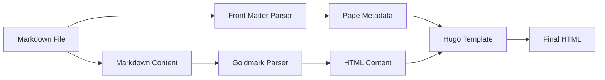
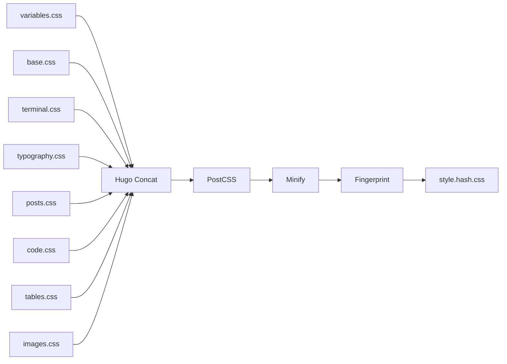
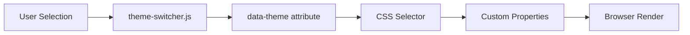

# Data Models

## Overview

This document describes the data structures and models used throughout the abrahamsustaita.com codebase. As a static site, data models consist primarily of:

1. **Content Models** - Front matter schemas for blog posts
2. **Configuration Models** - Site and theme configuration structures
3. **Design Token Models** - CSS custom property schemas
4. **State Models** - Client-side state management

## Content Models

### Blog Post Model

**Location:** `content/*.md`

**Format:** Markdown with YAML front matter

**Schema:**

```yaml
title: string        # Required
date: datetime       # Required (ISO 8601 format)
draft: boolean       # Optional (default: false)
tags: string[]       # Optional (default: [])
```

**Field Definitions:**

| Field | Type | Required | Default | Validation | Description |
|-------|------|----------|---------|------------|-------------|
| `title` | string | Yes | - | Non-empty | Post title displayed in listings and single view |
| `date` | datetime | Yes | - | ISO 8601 | Publication date (YYYY-MM-DDTHH:MM:SS-TZ) |
| `draft` | boolean | No | `false` | true/false | If true, post excluded from production builds |
| `tags` | array | No | `[]` | Array of strings | Taxonomy tags for categorization |

**Example:**

```yaml
---
title: "WezTerm: Project-Based Workspaces"
date: 2024-09-04T19:34:00-05:00
draft: false
tags: ["wezterm", "terminal", "productivity"]
---

Post content in Markdown...
```

**Derived Fields (Hugo-generated):**

```go
.File.BaseFileName  // string - Filename without extension
.RelPermalink       // string - Relative URL path
.Content            // HTML - Rendered Markdown content
.Summary            // HTML - Auto-generated summary
.WordCount          // int - Word count
.ReadingTime        // int - Estimated reading time in minutes
```

### Archetype Model

**Location:** `archetypes/default.md`

**Purpose:** Template for new content files

**Schema:**

```yaml
---
title: "{{ replace .Name "-" " " | title }}"
date: {{ .Date }}
draft: true
tags: []
---
```

**Template Variables:**

| Variable | Type | Description |
|----------|------|-------------|
| `.Name` | string | Filename passed to `hugo new` |
| `.Date` | datetime | Current timestamp |

**Usage:**

```bash
hugo new content/wezterm.3.keybindings.md
```

**Generated Output:**

```yaml
---
title: "Wezterm 3 Keybindings"
date: 2026-03-07T14:31:54-05:00
draft: true
tags: []
---
```

## Configuration Models

### Site Configuration Model

**Location:** `config.toml`

**Format:** TOML

**Schema:**

```toml
baseURL: string
languageCode: string
title: string

[params]
  contentTypeName: string
  description: string
  enableGitInfo: boolean
  favicon: string
  fullWidthTheme: boolean
  showLastUpdated: boolean

[markup.highlight]
  lineNos: boolean
  lineNumbersInTable: boolean
  noClasses: boolean
  style: string
  tabWidth: integer
```

**Field Definitions:**

| Field | Type | Default | Description |
|-------|------|---------|-------------|
| `baseURL` | string | - | Site base URL (must end with `/`) |
| `languageCode` | string | - | Language code (e.g., `en-us`) |
| `title` | string | - | Site title |
| `params.contentTypeName` | string | `"posts"` | Content type name |
| `params.description` | string | - | Site description for meta tags |
| `params.enableGitInfo` | boolean | `false` | Enable Git commit info |
| `params.favicon` | string | - | Favicon path relative to `static/` |
| `params.fullWidthTheme` | boolean | `false` | Enable full-width layout |
| `params.showLastUpdated` | boolean | `false` | Show last updated date on posts |
| `markup.highlight.lineNos` | boolean | `false` | Show line numbers in code blocks |
| `markup.highlight.lineNumbersInTable` | boolean | `false` | Use table for line numbers |
| `markup.highlight.noClasses` | boolean | `true` | Use inline styles vs CSS classes |
| `markup.highlight.style` | string | `"monokai"` | Syntax highlighting theme |
| `markup.highlight.tabWidth` | integer | `4` | Tab width in spaces |

**Current Values:**

```toml
baseURL = 'https://abrahamsustaita.com/'
languageCode = 'en-us'
title = 'abrahamsustaita.com'

[params]
  contentTypeName = "posts"
  description = "A terminal-style technical blog"
  enableGitInfo = true
  favicon = "favicon.ico"
  fullWidthTheme = true
  showLastUpdated = false

[markup.highlight]
  lineNos = true
  lineNumbersInTable = false
  noClasses = false
  style = "monokai"
  tabWidth = 4
```

### Theme Configuration Model

**Location:** `theme.toml`

**Format:** TOML

**Schema:**

```toml
name: string
license: string
licenselink: string
description: string
homepage: string
tags: string[]
features: string[]
min_version: string

[author]
  name: string
  homepage: string
```

**Field Definitions:**

| Field | Type | Description |
|-------|------|-------------|
| `name` | string | Theme name |
| `license` | string | License type (e.g., `"MIT"`) |
| `licenselink` | string | URL to license text |
| `description` | string | Theme description |
| `homepage` | string | Theme homepage URL |
| `tags` | array | Theme category tags |
| `features` | array | Theme feature list |
| `min_version` | string | Minimum Hugo version (semver) |
| `author.name` | string | Author name |
| `author.homepage` | string | Author homepage URL |

## Design Token Models

### Color Token Model

**Location:** `assets/css/variables.css`

**Format:** CSS custom properties

**Schema:**

```css
:root[data-theme="theme-name"] {
  --base: #hexcolor;
  --surface: #hexcolor;
  --overlay: #hexcolor;
  --text: #hexcolor;
  --subtle: #hexcolor;
  --muted: #hexcolor;
  --love: #hexcolor;
  --gold: #hexcolor;
  --rose: #hexcolor;
  --pine: #hexcolor;
  --foam: #hexcolor;
  --iris: #hexcolor;
}
```

**Token Definitions:**

| Token | Type | Purpose | Usage Examples |
|-------|------|---------|----------------|
| `--base` | color | Page background | `body { background: var(--base); }` |
| `--surface` | color | Elevated backgrounds | `.card { background: var(--surface); }` |
| `--overlay` | color | Borders, highlights | `.border { border-color: var(--overlay); }` |
| `--text` | color | Primary text | `body { color: var(--text); }` |
| `--subtle` | color | Secondary text | `.meta { color: var(--subtle); }` |
| `--muted` | color | Muted text | `.disabled { color: var(--muted); }` |
| `--love` | color | Errors, red accent | `.error { color: var(--love); }` |
| `--gold` | color | Warnings, types | `.warning { color: var(--gold); }` |
| `--rose` | color | Hover, inline code | `a:hover { color: var(--rose); }` |
| `--pine` | color | Prompts, operators | `.prompt { color: var(--pine); }` |
| `--foam` | color | Links, strings | `a { color: var(--foam); }` |
| `--iris` | color | Headings, keywords | `h1 { color: var(--iris); }` |

**Theme Palette Model:**

Each theme is a complete set of 12 color tokens:

```typescript
interface ThemePalette {
  name: string;
  tokens: {
    base: string;    // Hex color
    surface: string;
    overlay: string;
    text: string;
    subtle: string;
    muted: string;
    love: string;
    gold: string;
    rose: string;
    pine: string;
    foam: string;
    iris: string;
  };
}
```

**Available Themes:**

1. `rose-pine` (default)
2. `catppuccin-mocha`
3. `catppuccin-frappe`
4. `catppuccin-latte`
5. `catppuccin-macchiato`
6. `dracula`
7. `nord`
8. `gruvbox-dark`
9. `gruvbox-light`
10. `tokyo-night`
11. `one-dark`
12. `solarized-dark`
13. `solarized-light`

## State Models

### Theme State Model

**Location:** Browser localStorage

**Format:** JSON

**Schema:**

```typescript
interface ThemeState {
  theme: ThemeName;
}

type ThemeName = 
  | "rose-pine"
  | "catppuccin-mocha"
  | "catppuccin-frappe"
  | "catppuccin-latte"
  | "catppuccin-macchiato"
  | "dracula"
  | "nord"
  | "gruvbox-dark"
  | "gruvbox-light"
  | "tokyo-night"
  | "one-dark"
  | "solarized-dark"
  | "solarized-light";
```

**Storage:**

```javascript
// Read
const theme = localStorage.getItem('theme');  // Returns string | null

// Write
localStorage.setItem('theme', 'rose-pine');

// Default
const theme = localStorage.getItem('theme') || 'rose-pine';
```

**State Lifecycle:**

```mermaid
stateDiagram-v2
    [*] --> Default: Page load
    Default --> Restored: localStorage exists
    Default --> RosePine: localStorage empty
    Restored --> Active: Apply theme
    RosePine --> Active: Apply theme
    Active --> Changed: User selects theme
    Changed --> Active: Update DOM
    Changed --> Persisted: Save to localStorage
    Persisted --> Active
```

## Hugo Page Model

### Page Variables

Hugo provides a rich page model accessible in templates:

```go
// Page metadata
.Title           // string - Page title
.Date            // time.Time - Publication date
.Lastmod         // time.Time - Last modification date
.PublishDate     // time.Time - Publish date
.ExpiryDate      // time.Time - Expiry date
.Draft           // bool - Draft status

// Content
.Content         // template.HTML - Rendered content
.Summary         // template.HTML - Auto-generated summary
.Truncated       // bool - Whether summary was truncated
.WordCount       // int - Word count
.ReadingTime     // int - Estimated reading time (minutes)
.RawContent      // string - Raw Markdown content

// File info
.File.Path       // string - File path
.File.Dir        // string - Directory path
.File.LogicalName // string - Filename
.File.BaseFileName // string - Filename without extension

// URLs
.Permalink       // string - Absolute URL
.RelPermalink    // string - Relative URL
.Slug            // string - URL slug

// Taxonomy
.Params.tags     // []string - Tags
.GetTerms "tags" // []Page - Tag pages

// Section
.Section         // string - Section name
.Type            // string - Content type
.Kind            // string - Page kind (page, home, section, taxonomy, term)

// Site
.Site.Title      // string - Site title
.Site.BaseURL    // string - Base URL
.Site.Params     // map - Site parameters
```

### List Page Model

For list pages (section listings, taxonomies):

```go
.Pages           // []Page - List of pages
.Paginator       // Paginator - Pagination object
.Data.Pages      // []Page - Filtered pages
```

## Shortcode Parameter Models

### Image Shortcode Parameters

```typescript
interface ImageParams {
  src: string;           // Required - Image filename
  alt: string;           // Required - Alt text
  caption?: string;      // Optional - Image caption
  loading?: "lazy" | "eager";  // Optional - Loading strategy
}
```

**Usage:**

```markdown

```

### Image Grid Shortcode Parameters

```typescript
interface ImageGridParams {
  images: string;  // Required - Comma-separated image filenames
}
```

**Usage:**

```markdown

```

## File Naming Model

### Content File Naming Convention

**Pattern:** `topic.sequence.subtitle.md`

**Components:**

| Component | Type | Description | Example |
|-----------|------|-------------|---------|
| `topic` | string | Main topic or series name | `wezterm`, `ai` |
| `sequence` | integer | Sequential number within topic | `1`, `2`, `3` |
| `subtitle` | string | Descriptive subtitle | `projects`, `ui`, `keybindings` |

**Examples:**

- `wezterm.1.projects.md` - First post in WezTerm series about projects
- `wezterm.2.ui.md` - Second post in WezTerm series about UI
- `ai.refactor.website.md` - AI series post about website refactoring
- `ai.writing.blog-posts.md` - AI series post about writing blog posts

**Benefits:**

- Alphabetical sorting groups related posts
- Sequence number indicates reading order
- Descriptive subtitle aids discovery

## Data Validation

### Front Matter Validation

**Required Fields:**

```yaml
title: "Must be non-empty string"
date: "Must be valid ISO 8601 datetime"
```

**Optional Fields:**

```yaml
draft: true | false  # Must be boolean if present
tags: ["string", "string"]  # Must be array of strings if present
```

**Hugo Validation:**

- Hugo will error if `title` or `date` is missing
- Hugo will warn if `date` format is invalid
- Hugo will ignore unknown fields

### Configuration Validation

**Hugo validates:**

- `baseURL` must be valid URL
- `languageCode` should be valid language code
- `min_version` in `theme.toml` must be valid semver

**PostCSS validates:**

- `postcss.config.js` must export valid configuration object
- Plugin names must resolve to installed packages

### CSS Custom Property Validation

**Browser validation:**

- Invalid hex colors fall back to inherited value
- Missing custom properties fall back to inherited value
- No build-time validation (runtime only)

**Recommendation:**

- Use CSS linting tools (stylelint) to validate custom properties
- Test all themes visually to ensure complete token definitions

## Data Transformation

### Markdown → HTML



### CSS Modules → Concatenated CSS



### Theme Selection → CSS Variables



## Data Persistence

### Content Persistence

- **Storage:** Git repository
- **Format:** Markdown files with YAML front matter
- **Versioning:** Git commit history
- **Backup:** GitHub remote repository

### Configuration Persistence

- **Storage:** Git repository
- **Format:** TOML and JSON files
- **Versioning:** Git commit history
- **Backup:** GitHub remote repository

### Theme Preference Persistence

- **Storage:** Browser localStorage
- **Format:** JSON string
- **Lifetime:** Until user clears browser data
- **Backup:** None (user preference, not critical data)

### Generated Site Persistence

- **Storage:** GitHub Pages
- **Format:** Static HTML/CSS/JS files
- **Versioning:** `gh-pages` branch
- **Backup:** Reproducible from source

## Data Migration

### Adding New Front Matter Fields

1. Update archetype in `archetypes/default.md`
2. Update existing posts manually or via script
3. Update templates to use new fields
4. Document in AGENTS.md

### Changing Configuration Schema

1. Update `config.toml` with new fields
2. Update templates that reference configuration
3. Test with `hugo server`
4. Document breaking changes in AGENTS.md

### Adding New Color Tokens

1. Add token to all theme definitions in `variables.css`
2. Update documentation in AGENTS.md
3. Use token in CSS modules
4. Test all 13 themes visually

## Data Constraints

### Content Constraints

- File names MUST follow `topic.sequence.subtitle.md` pattern
- Front matter MUST include `title` and `date`
- Tags MUST be lowercase for consistency
- Dates MUST include timezone offset

### Configuration Constraints

- `baseURL` MUST end with `/`
- `min_version` MUST be valid semver
- Theme names MUST match CSS `data-theme` values

### Design Token Constraints

- All themes MUST define all 12 color tokens
- Color values MUST be valid hex colors
- Token names MUST start with `--`

### State Constraints

- Theme name MUST be one of 13 valid theme names
- localStorage key MUST be `'theme'`
- Fallback theme MUST be `'rose-pine'`
