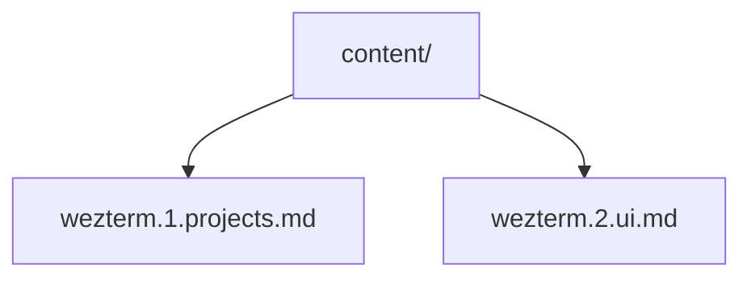
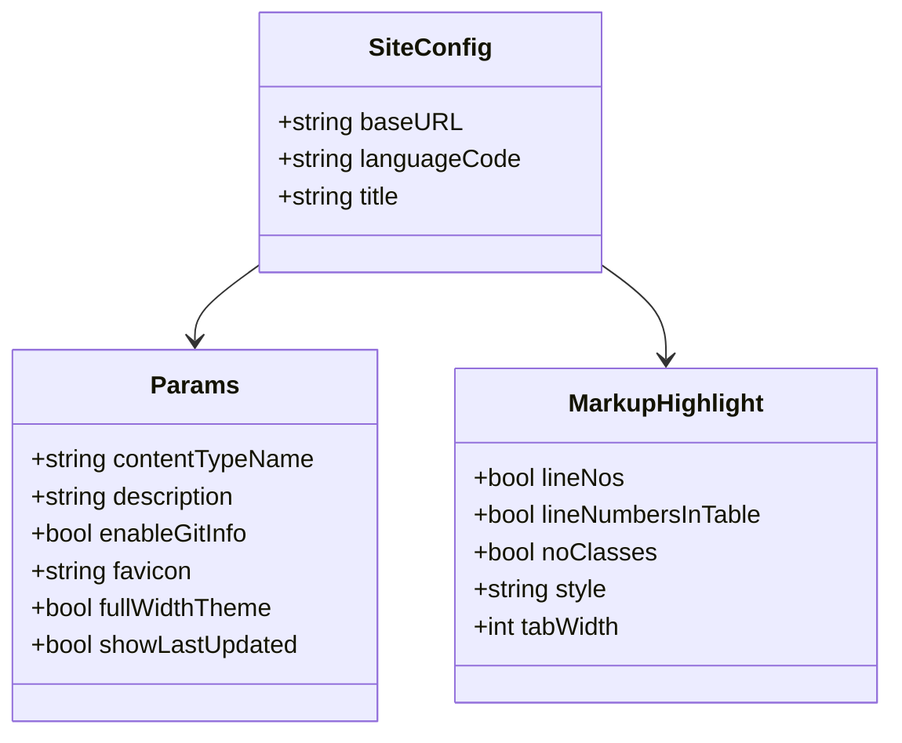

# Data Models

## Content Front Matter

Every Markdown file in `content/` uses YAML front matter:

```yaml
---
title: "Post Title"       # Required — displayed as h1 and in listings
date: 2024-12-25          # Required — used for sorting and display
draft: false               # Optional — if true, excluded from production build
tags: ["tag1", "tag2"]     # Optional — displayed in post meta
---
```

Hugo automatically derives additional fields:

| Field | Source | Description |
|---|---|---|
| `.ReadingTime` | Content length | Estimated minutes to read |
| `.File.BaseFileName` | Filename | Used in terminal prompt (`cat filename.md`) |
| `.RelPermalink` | Directory + filename | URL path for the post |
| `.Content` | Markdown body | Rendered HTML content |
| `.GitInfo` | Git history | Last modified date (when `enableGitInfo = true`) |

## Content Organization



Posts are flat files in `content/` (no subdirectory nesting). The naming convention uses dot-separated segments:
`topic.sequence.subtitle.md`.

## Hugo Site Configuration Model

Defined in `config.toml`:



## CSS Custom Properties Model

The design token system in `variables.css`. Default theme (rose-pine) is defined in `:root`, with 12 additional themes as `[data-theme]` attribute selectors.

### Theme Switching

Themes are applied via `data-theme` attribute on `<html>`:

```html
<html data-theme="tron-ares">
```

When no attribute is set, `:root` values apply (rose-pine default).

### Color Token Schema

All 13 themes use the same 12 custom properties:

| Token | Category | Semantic Use |
|---|---|---|
| `--base` | Background | Page background |
| `--surface` | Background | Elevated surfaces |
| `--overlay` | Background | Borders, table headers, highlights |
| `--text` | Foreground | Primary body text |
| `--subtle` | Foreground | Secondary/caption text |
| `--muted` | Foreground | Tertiary text, code comments |
| `--love` | Accent | Errors, red accent |
| `--gold` | Accent | Warnings, yellow accent, types |
| `--rose` | Accent | Hover states, inline code, attributes |
| `--pine` | Accent | Prompts, operators, blockquote borders |
| `--foam` | Accent | Links, strings |
| `--iris` | Accent | Headings, keywords, selection, phosphor glow |

### Available Themes

13 themes ported from dotfiles kitty configs:

- rose-pine (default)
- catppuccin-mocha
- catppuccin-frappe
- prism
- crystals
- tron-ares
- enterprise-desert
- ai-machine
- ai-flower
- aurora
- headphones
- fantasy-autumn
- color-wall

### localStorage Schema

```
Key:   "theme"
Value: "rose-pine" | "catppuccin-mocha" | ... (theme name string)
```

If key is absent, default theme (rose-pine) applies.

## Archetype Template

New content created via `hugo new` uses `archetypes/default.md`:

```yaml
---
title: "{{ replace .Name "-" " " | title }}"
date: {{ .Date }}
draft: true
tags: []
---
```
