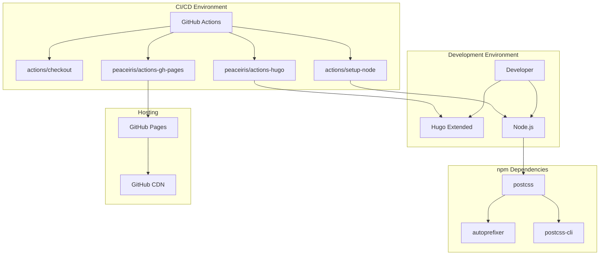

# Dependencies

## Overview

This document provides a comprehensive inventory of all dependencies used in the abrahamsustaita.com project, including runtime dependencies, build dependencies, and external services.

## Dependency Categories

1. **Build-Time Dependencies** - Required to build the site
2. **Development Dependencies** - Required for local development
3. **CI/CD Dependencies** - Required for automated deployment
4. **Runtime Dependencies** - Required for the site to function (none for static sites)
5. **External Services** - Third-party services used

## Build-Time Dependencies

### Hugo Extended

**Version:** v0.157.0+ (minimum v0.80.0)  
**Purpose:** Static site generator  
**License:** Apache 2.0  
**Installation:**

```bash
# macOS
brew install hugo

# Linux
snap install hugo --channel=extended

# Windows
choco install hugo-extended
```

**Why Extended?**

- Required for SCSS/PostCSS processing
- Provides Hugo Pipes asset pipeline
- Enables advanced CSS features

**Update Frequency:** Quarterly

**Breaking Changes:** Rare (Hugo maintains backward compatibility)

### Node.js

**Version:** v20.x (LTS)  
**Purpose:** Run PostCSS toolchain  
**License:** MIT  
**Installation:**

```bash
# macOS
brew install node

# Linux
curl -fsSL https://deb.nodesource.com/setup_20.x | sudo -E bash -
sudo apt-get install -y nodejs

# Windows
choco install nodejs-lts
```

**Update Frequency:** Annually (when new LTS is released)

## Development Dependencies (npm)

### autoprefixer

**Version:** ^10.4.20  
**Purpose:** Add vendor prefixes to CSS  
**License:** MIT  
**Repository:** <https://github.com/postcss/autoprefixer>

**Configuration:**

```javascript
// postcss.config.js
module.exports = {
  plugins: [
    require('autoprefixer')
  ]
}
```

**Browser Support:**

- Last 2 versions of major browsers
- Configurable via `.browserslistrc` (not currently used)

**Update Frequency:** Monthly

### postcss

**Version:** ^8.4.49  
**Purpose:** CSS transformation tool  
**License:** MIT  
**Repository:** <https://github.com/postcss/postcss>

**Usage:**

- Processes CSS through plugins (Autoprefixer)
- Integrated with Hugo Pipes
- No direct CLI usage

**Update Frequency:** Monthly

### postcss-cli

**Version:** ^11.0.0  
**Purpose:** PostCSS command-line interface  
**License:** MIT  
**Repository:** <https://github.com/postcss/postcss-cli>

**Usage:**

- Enables Hugo to invoke PostCSS
- Not directly invoked by developers

**Update Frequency:** Quarterly

## CI/CD Dependencies (GitHub Actions)

### actions/checkout

**Version:** v4  
**Purpose:** Check out repository code  
**Repository:** <https://github.com/actions/checkout>

**Configuration:**

```yaml
- uses: actions/checkout@v4
  with:
    submodules: true
    fetch-depth: 0
```

**Options:**

- `submodules: true` - Check out Git submodules (if any)
- `fetch-depth: 0` - Fetch all history (for Git info)

**Update Strategy:** Auto-updates to latest v4.x

### peaceiris/actions-hugo

**Version:** v2  
**Purpose:** Install Hugo in CI environment  
**Repository:** <https://github.com/peaceiris/actions-hugo>

**Configuration:**

```yaml
- uses: peaceiris/actions-hugo@v2
  with:
    hugo-version: "latest"
    extended: true
```

**Options:**

- `hugo-version: "latest"` - Use latest Hugo release
- `extended: true` - Install Hugo Extended

**Update Strategy:** Auto-updates to latest v2.x

### actions/setup-node

**Version:** v4  
**Purpose:** Install Node.js in CI environment  
**Repository:** <https://github.com/actions/setup-node>

**Configuration:**

```yaml
- uses: actions/setup-node@v4
  with:
    node-version: "20"
```

**Options:**

- `node-version: "20"` - Install Node.js 20.x LTS

**Update Strategy:** Auto-updates to latest v4.x

### peaceiris/actions-gh-pages

**Version:** v3  
**Purpose:** Deploy to GitHub Pages  
**Repository:** <https://github.com/peaceiris/actions-gh-pages>

**Configuration:**

```yaml
- uses: peaceiris/actions-gh-pages@v3
  if: github.ref == 'refs/heads/main'
  with:
    github_token: ${{ secrets.GITHUB_TOKEN }}
    publish_dir: ./public
```

**Options:**

- `github_token` - Authentication token (auto-provided)
- `publish_dir` - Directory to deploy

**Update Strategy:** Auto-updates to latest v3.x

## Runtime Dependencies

### None

This is a static site with no runtime dependencies. All JavaScript is vanilla JS with no external libraries.

**Browser APIs Used:**

- `localStorage` - Theme persistence
- `document.getElementById` - DOM manipulation
- `addEventListener` - Event handling
- `setAttribute` - Theme attribute updates

**Browser Support:**

- Chrome/Edge: Last 2 versions
- Firefox: Last 2 versions
- Safari: Last 2 versions
- No IE11 support (CSS custom properties required)

## External Services

### GitHub

**Purpose:** Source code hosting and version control  
**Plan:** Free (public repository)  
**Features Used:**

- Git repository hosting
- GitHub Actions (CI/CD)
- GitHub Pages (static hosting)

**Limits:**

- GitHub Actions: 2,000 minutes/month (free tier)
- GitHub Pages: 100 GB bandwidth/month
- Repository size: Soft limit 1 GB

**Alternatives:** GitLab, Bitbucket, Codeberg

### GitHub Pages

**Purpose:** Static site hosting  
**Plan:** Free (public repository)  
**Features:**

- HTTPS enforced
- Custom domain support
- CDN distribution
- Automatic SSL certificates

**Configuration:**

- Source: `gh-pages` branch
- Custom domain: `abrahamsustaita.com`
- HTTPS: Enforced

**Alternatives:** Netlify, Vercel, Cloudflare Pages

## Dependency Graph



## Dependency Management

### Updating npm Dependencies

**Check for updates:**

```bash
npm outdated
```

**Update all dependencies:**

```bash
npm update
```

**Update specific dependency:**

```bash
npm update autoprefixer
```

**Update to latest (including major versions):**

```bash
npm install autoprefixer@latest postcss@latest postcss-cli@latest
```

**Verify updates:**

```bash
npm list
hugo --minify  # Test build
```

### Updating Hugo

**Check current version:**

```bash
hugo version
```

**Update via package manager:**

```bash
# macOS
brew upgrade hugo

# Linux
sudo snap refresh hugo

# Windows
choco upgrade hugo-extended
```

**Verify update:**

```bash
hugo version
hugo server  # Test dev server
```

### Updating GitHub Actions

GitHub Actions auto-update to latest minor versions (e.g., `v4` → `v4.x`).

**Manual major version updates:**

1. Edit `.github/workflows/gh-pages.yml`
2. Update action versions (e.g., `v4` → `v5`)
3. Test workflow on a branch
4. Merge to main

## Security Considerations

### Dependency Vulnerabilities

**Check for vulnerabilities:**

```bash
npm audit
```

**Fix vulnerabilities:**

```bash
npm audit fix
```

**Force fix (may introduce breaking changes):**

```bash
npm audit fix --force
```

### Subresource Integrity (SRI)

Hugo automatically generates SRI hashes for assets:

```html
<link rel="stylesheet" href="/css/style.abc123.css" integrity="sha256-xyz...">
```

**Benefits:**

- Prevents tampering with assets
- Ensures asset integrity
- Protects against CDN compromises

### Dependabot

**Status:** Not currently enabled

**Recommendation:** Enable Dependabot for automated dependency updates

**Configuration:**

```yaml
# .github/dependabot.yml
version: 2
updates:
  - package-ecosystem: "npm"
    directory: "/"
    schedule:
      interval: "monthly"
  - package-ecosystem: "github-actions"
    directory: "/"
    schedule:
      interval: "monthly"
```

## Dependency Licenses

| Dependency | License | Commercial Use | Attribution Required |
|------------|---------|----------------|----------------------|
| Hugo | Apache 2.0 | ✅ Yes | ❌ No |
| Node.js | MIT | ✅ Yes | ❌ No |
| autoprefixer | MIT | ✅ Yes | ❌ No |
| postcss | MIT | ✅ Yes | ❌ No |
| postcss-cli | MIT | ✅ Yes | ❌ No |
| actions/checkout | MIT | ✅ Yes | ❌ No |
| peaceiris/actions-hugo | MIT | ✅ Yes | ❌ No |
| actions/setup-node | MIT | ✅ Yes | ❌ No |
| peaceiris/actions-gh-pages | MIT | ✅ Yes | ❌ No |

**License Compatibility:** All dependencies use permissive licenses (MIT, Apache 2.0) compatible with commercial use.

## Dependency Alternatives

### Hugo Alternatives

| Alternative | Pros | Cons |
|-------------|------|------|
| Jekyll | GitHub Pages native support | Slower builds, Ruby dependency |
| Eleventy | Flexible, JavaScript-based | Less mature ecosystem |
| Gatsby | React-based, rich plugins | Heavy, complex setup |
| Next.js | Modern, React-based | Overkill for simple blog |

**Verdict:** Hugo is optimal for this use case (fast builds, simple setup, no runtime dependencies).

### PostCSS Alternatives

| Alternative | Pros | Cons |
|-------------|------|------|
| Sass/SCSS | Mature, widely used | Requires Ruby or Dart Sass |
| Less | Simple syntax | Less active development |
| Stylus | Flexible syntax | Declining popularity |
| Native CSS | No build step | No vendor prefixing |

**Verdict:** PostCSS is optimal (minimal, focused on Autoprefixer only).

### GitHub Pages Alternatives

| Alternative | Pros | Cons |
|-------------|------|------|
| Netlify | Better build features, edge functions | Overkill for simple blog |
| Vercel | Excellent DX, fast deploys | Overkill for simple blog |
| Cloudflare Pages | Fast CDN, generous limits | Less mature than competitors |
| AWS S3 + CloudFront | Full control, scalable | Complex setup, costs money |

**Verdict:** GitHub Pages is optimal (free, simple, integrated with GitHub).

## Dependency Risks

### Hugo Extended Availability

**Risk:** Hugo Extended not available on some platforms

**Mitigation:**

- Use official package managers (Homebrew, Snap, Chocolatey)
- GitHub Actions uses `peaceiris/actions-hugo` which handles Extended version
- Document installation in README.md

### npm Dependency Bloat

**Risk:** npm dependencies grow over time

**Mitigation:**

- Keep dependencies minimal (currently only 3)
- Regularly audit dependencies with `npm audit`
- Remove unused dependencies
- Avoid adding new dependencies unless necessary

### GitHub Actions Rate Limits

**Risk:** Exceed GitHub Actions free tier (2,000 minutes/month)

**Mitigation:**

- Current usage: ~2 minutes per deployment
- ~1,000 deployments/month available
- Monitor usage in GitHub Settings → Billing
- Optimize workflow if needed

### GitHub Pages Bandwidth Limits

**Risk:** Exceed 100 GB bandwidth/month

**Mitigation:**

- Current site size: ~50 KB per page
- ~2 million page views/month available
- Monitor usage in GitHub repository Insights
- Add CDN if needed (Cloudflare)

## Dependency Monitoring

### Automated Monitoring

**Recommendation:** Enable GitHub Dependabot

**Benefits:**

- Automatic pull requests for dependency updates
- Security vulnerability alerts
- Automated testing of updates

### Manual Monitoring

**Monthly tasks:**

```bash
# Check for npm updates
npm outdated

# Check for Hugo updates
hugo version
brew info hugo  # macOS

# Check for security vulnerabilities
npm audit
```

**Quarterly tasks:**

- Review GitHub Actions workflow
- Check for new Hugo features
- Review PostCSS plugin ecosystem

## Dependency Documentation

### Where to Find Documentation

| Dependency | Documentation URL |
|------------|-------------------|
| Hugo | <https://gohugo.io/documentation/> |
| PostCSS | <https://postcss.org/> |
| Autoprefixer | <https://github.com/postcss/autoprefixer> |
| GitHub Actions | <https://docs.github.com/en/actions> |
| GitHub Pages | <https://docs.github.com/en/pages> |

### Internal Documentation

- **AGENTS.md** - Project overview and conventions
- **README.md** - Quick start and basic usage
- **.sop/summary/** - Detailed codebase documentation

## Dependency Changelog

### Recent Updates

**2026-03-07:**

- Hugo: v0.157.0 (current)
- Node.js: v20.x LTS
- autoprefixer: ^10.4.20
- postcss: ^8.4.49
- postcss-cli: ^11.0.0

### Update History

Track dependency updates in Git commit history:

```bash
git log --grep="chore: update" --oneline
```

## Future Dependency Considerations

### Potential Additions

1. **Markdown Linter** - Ensure consistent Markdown formatting
   - `markdownlint-cli`
   - Run in CI/CD pipeline

2. **CSS Linter** - Validate CSS custom properties
   - `stylelint`
   - Ensure all themes define all tokens

3. **HTML Validator** - Validate generated HTML
   - `html-validate`
   - Catch template errors

4. **Image Optimization** - Compress images automatically
   - `imagemin`
   - Reduce page weight

5. **Analytics** - Privacy-friendly analytics
   - Plausible or Fathom
   - No cookies, GDPR-compliant

### Dependencies to Avoid

1. **jQuery** - Not needed for simple theme switching
2. **Bootstrap** - Custom CSS is simpler and lighter
3. **React/Vue** - Overkill for static blog
4. **Webpack/Vite** - Hugo Pipes is sufficient
5. **Sass** - PostCSS is simpler for this use case

## Dependency Best Practices

1. **Keep dependencies minimal** - Only add when necessary
2. **Use exact versions in CI** - Ensure reproducible builds
3. **Update regularly** - Monthly for npm, quarterly for Hugo
4. **Test updates locally** - Before pushing to production
5. **Document breaking changes** - In AGENTS.md
6. **Monitor security advisories** - Enable Dependabot
7. **Prefer stable versions** - Avoid pre-release versions
8. **Use LTS versions** - For Node.js and other runtimes
