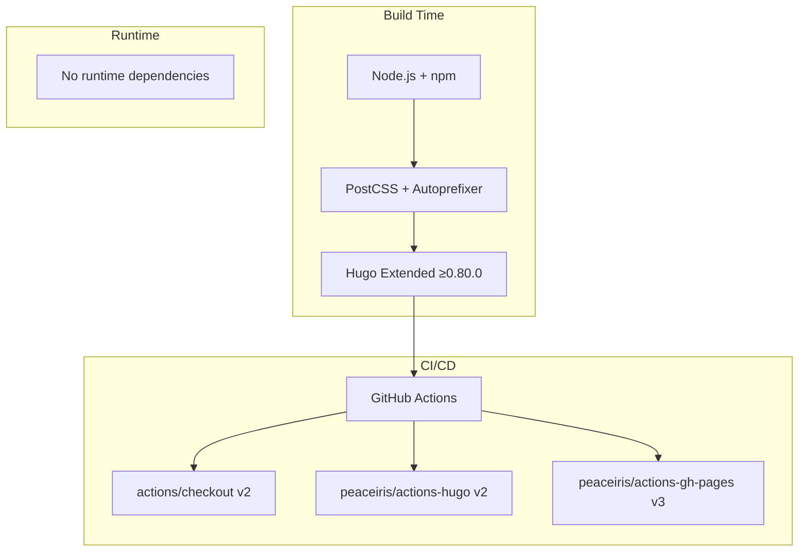

# Dependencies

## Runtime Dependencies

None. The site is fully static HTML/CSS with no JavaScript runtime dependencies (aside from the pre-built
`bundle.min.js` in `public/`).

## Build Dependencies

### Hugo

- **Version:** Latest extended (minimum 0.80.0 per `theme.toml`)
- **Variant:** Extended (required for CSS processing via Hugo Pipes)
- **Purpose:** Static site generation, template rendering, CSS pipeline

### Node.js / npm

Required for PostCSS processing.

| Package | Version | Purpose |
|---|---|---|
| `autoprefixer` | `^10.4.20` | Adds vendor prefixes to CSS for browser compatibility |
| `postcss` | `^8.4.49` | CSS transformation framework |
| `postcss-cli` | `^11.0.0` | CLI interface for PostCSS |

### PostCSS Configuration

`postcss.config.js` — minimal config that enables only Autoprefixer:

```javascript
module.exports = {
  plugins: [require('autoprefixer')],
};
```

## CI/CD Dependencies

### GitHub Actions

| Action | Version | Purpose |
|---|---|---|
| `actions/checkout` | `v2` | Repository checkout with submodule support |
| `peaceiris/actions-hugo` | `v2` | Hugo installation |
| `peaceiris/actions-gh-pages` | `v3` | GitHub Pages deployment |

### Deployment Requirements

- GitHub repository with Pages enabled
- `GITHUB_TOKEN` secret (automatically provided by GitHub Actions)
- `main` branch as deployment source

## Font Dependencies

- **FiraCode Bold** (`fonts/FiraCode-Bold.woff`)
- **FiraCode Regular** (`fonts/FiraCode-Regular.woff`)

These are bundled in `public/fonts/` and served statically. The CSS font stack falls back to system monospace
fonts: SF Mono, Monaco, Menlo, Consolas, Ubuntu Mono.

## Dependency Graph


