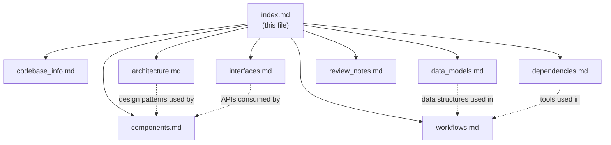

# Documentation Index

## For AI Assistants

This is the primary entry point for understanding the abrahamsustaita.com codebase. Start here to determine which
documentation file to consult for a given question.

### How to Use This Index

1. Read the file summaries below to identify which document answers your question
2. Load only the relevant file(s) into context
3. Cross-reference between files using the relationships noted below

## Table of Contents

### `codebase_info.md`

**Purpose:** Quick-reference overview of the project — languages, directories, build tools, and deployment.

**Consult when:** You need a high-level understanding of what this project is, what technologies it uses, or where
files are located.

### `architecture.md`

**Purpose:** System architecture, design patterns (terminal UI metaphor, modular CSS, Rosé Pine Moon color system),
and responsive design breakpoints.

**Consult when:** You need to understand the overall design philosophy, the CSS architecture, the color palette, or
how the build pipeline works end-to-end.

### `components.md`

**Purpose:** Detailed documentation of every component — layout templates (`baseof.html`, `single.html`,
`list.html`), shortcodes (`image`, `image-grid`), CSS modules, content structure, and static assets.

**Consult when:** You need to modify or understand a specific template, shortcode, or CSS module. This is the most
useful file for day-to-day development tasks.

### `interfaces.md`

**Purpose:** Template block system, shortcode API, Hugo Pipes CSS pipeline, configuration schema, and the GitHub
Actions deployment interface.

**Consult when:** You need to understand how components connect — template inheritance, shortcode parameters,
configuration options, or the CI/CD pipeline.

### `data_models.md`

**Purpose:** Content front matter schema, Hugo-derived fields, content organization conventions, site configuration
model, CSS custom properties model, and archetype template.

**Consult when:** You need to create new content, modify front matter, change configuration, or update design tokens.

### `workflows.md`

**Purpose:** Step-by-step workflows for content authoring, building, deploying, adding images, modifying CSS, and
adding new CSS modules.

**Consult when:** You need to perform a specific task and want the exact steps to follow.

### `dependencies.md`

**Purpose:** All build, CI/CD, and font dependencies with versions and purposes.

**Consult when:** You need to update dependencies, troubleshoot build issues, or understand what external tools are
required.

### `review_notes.md`

**Purpose:** Documentation quality review — consistency issues, completeness gaps, and improvement recommendations.

**Consult when:** You want to understand limitations of this documentation or areas that need attention.

## File Relationships

## Quick Reference

| Question | File |
|---|---|
| What is this project? | `codebase_info.md` |
| How is the site structured? | `architecture.md` |
| How do I modify a template? | `components.md` |
| What parameters does a shortcode accept? | `interfaces.md` |
| How do I create a new blog post? | `workflows.md` |
| What front matter fields are available? | `data_models.md` |
| What Hugo version is required? | `dependencies.md` |
| What color is `--foam`? | `architecture.md` or `data_models.md` |
| How does deployment work? | `interfaces.md` or `workflows.md` |
