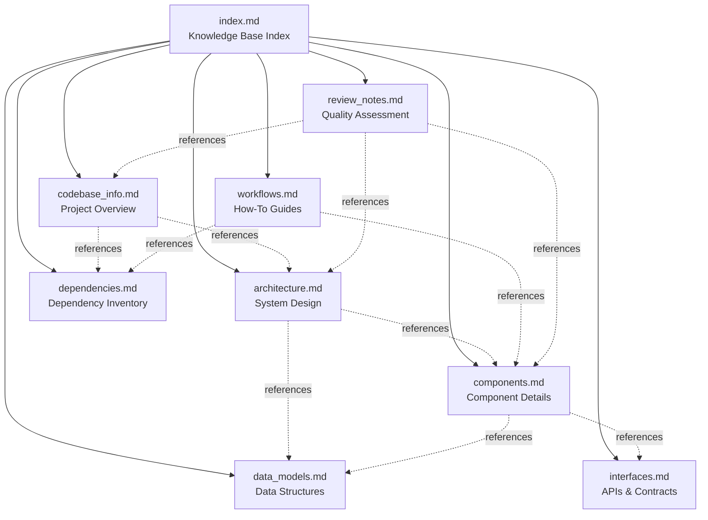

# Codebase Knowledge Base Index

## For AI Assistants: How to Use This Documentation

This index serves as your primary entry point for understanding the abrahamsustaita.com codebase. Each file in this directory contains detailed information about specific aspects of the system. Use this index to quickly locate relevant information based on the type of question or task.

### Quick Navigation Strategy

1. **Architecture questions** → `architecture.md`
2. **Component details** → `components.md`
3. **API/interface questions** → `interfaces.md`
4. **Data structure questions** → `data_models.md`
5. **How-to questions** → `workflows.md`
6. **Dependency questions** → `dependencies.md`
7. **Project overview** → `codebase_info.md`
8. **Documentation quality** → `review_notes.md`

### When to Consult Multiple Files

- **Adding new features** → workflows.md + components.md + architecture.md
- **Debugging issues** → workflows.md + review_notes.md + components.md
- **Understanding data flow** → architecture.md + data_models.md + interfaces.md
- **Updating dependencies** → dependencies.md + workflows.md
- **Modifying templates** → components.md + interfaces.md + data_models.md

## Documentation Files

### codebase_info.md

**Purpose:** High-level project overview and structure

**Contains:**

- Project metadata (name, URL, license)
- Technology stack (Hugo, PostCSS, Node.js)
- Directory structure with explanations
- File counts by type
- Key architectural patterns summary
- Design system overview
- Development workflow commands
- External dependencies list
- Language support information
- Integration points

**When to use:**

- Getting initial understanding of the project
- Understanding project structure
- Identifying technologies used
- Finding file locations
- Understanding basic patterns

**Key sections:**

- Technology Stack
- Project Structure
- File Counts by Type
- Key Architectural Patterns
- Design System
- Development Workflow
- External Dependencies

### architecture.md

**Purpose:** System design, patterns, and architectural decisions

**Contains:**

- System overview and architectural diagram
- Design patterns (template inheritance, modular CSS, design tokens, progressive enhancement, asset pipeline)
- Architectural layers (content, presentation, style, behavior, build, deployment)
- Data flow diagrams (build-time and runtime)
- Architectural decisions with rationale and trade-offs
- Scalability considerations
- Security considerations
- Performance characteristics
- Maintenance considerations

**When to use:**

- Understanding system design
- Making architectural decisions
- Understanding component relationships
- Planning major changes
- Evaluating scalability
- Understanding performance characteristics

**Key sections:**

- Architectural Diagram
- Design Patterns
- Architectural Layers
- Data Flow
- Architectural Decisions
- Scalability Considerations
- Performance Characteristics

**Mermaid diagrams:**

- System architecture overview
- Build-time data flow
- Runtime theme switching flow

### components.md

**Purpose:** Detailed documentation of all system components

**Contains:**

- Component overview and hierarchy
- Template components (baseof.html, single.html, list.html, index.html, tags.html, tag.html, shortcodes)
- Style components (all 9 CSS modules)
- Behavior components (theme-init.js, theme-switcher.js)
- Component dependencies and interactions
- Component testing considerations
- Component maintenance procedures

**When to use:**

- Understanding specific components
- Modifying existing components
- Adding new components
- Understanding component dependencies
- Debugging component issues
- Planning component changes

**Key sections:**

- Component Hierarchy (diagram)
- Template Components (detailed breakdown)
- Style Components (detailed breakdown)
- Behavior Components (detailed breakdown)
- Component Dependencies (diagram)
- Component Interaction Patterns
- Component Maintenance

**Mermaid diagrams:**

- Component hierarchy
- Component dependencies

### interfaces.md

**Purpose:** APIs, contracts, and integration points

**Contains:**

- Configuration interfaces (config.toml, theme.toml, package.json, postcss.config.js)
- Template interfaces (Hugo template contracts, context variables)
- Shortcode interfaces (image, image-grid APIs)
- Front matter interface (content file schema)
- Browser APIs (localStorage, DOM)
- Build interfaces (Hugo Pipes, PostCSS)
- Deployment interfaces (GitHub Actions, GitHub Pages)
- CSS custom properties interface (theme tokens)
- Integration point diagrams
- Error handling strategies
- API versioning information

**When to use:**

- Understanding API contracts
- Using shortcodes
- Configuring the site
- Understanding build pipeline
- Integrating external services
- Understanding deployment process
- Debugging integration issues

**Key sections:**

- Configuration Interfaces
- Template Interfaces
- Shortcode Interfaces
- Front Matter Interface
- Browser APIs
- Build Interfaces
- Deployment Interfaces
- CSS Custom Properties Interface
- Integration Points (diagrams)
- Error Handling

**Mermaid diagrams:**

- Hugo ↔ PostCSS integration
- Browser ↔ localStorage interaction
- GitHub Actions ↔ GitHub Pages deployment

### data_models.md

**Purpose:** Data structures, schemas, and models

**Contains:**

- Content models (blog post schema, archetype model)
- Configuration models (site config, theme config)
- Design token models (color token schema, theme palette model)
- State models (theme state in localStorage)
- Hugo page model (available variables)
- Shortcode parameter models
- File naming conventions
- Data validation rules
- Data transformation flows
- Data persistence strategies
- Data migration procedures
- Data constraints

**When to use:**

- Understanding data structures
- Creating new content
- Modifying front matter
- Understanding configuration options
- Working with design tokens
- Understanding state management
- Validating data
- Planning data migrations

**Key sections:**

- Blog Post Model
- Configuration Models
- Design Token Models
- State Models
- Hugo Page Model
- Shortcode Parameter Models
- File Naming Model
- Data Validation
- Data Transformation (diagrams)
- Data Persistence
- Data Constraints

**Mermaid diagrams:**

- Theme state lifecycle
- Markdown → HTML transformation
- CSS modules → concatenated CSS
- Theme selection → CSS variables

### workflows.md

**Purpose:** Step-by-step guides for common tasks

**Contains:**

- Initial setup workflow
- Creating new blog posts
- Adding new CSS modules
- Adding new themes
- Creating new shortcodes
- Modifying existing templates
- Updating dependencies
- Deploying changes
- Troubleshooting build failures
- Testing theme switching
- Common workflows summary table
- Workflow best practices

**When to use:**

- Performing common tasks
- Learning development workflow
- Troubleshooting issues
- Understanding deployment process
- Adding new features
- Updating dependencies
- Testing changes

**Key sections:**

- Initial Setup
- Creating a New Blog Post
- Adding a New CSS Module
- Adding a New Theme
- Creating a New Shortcode
- Modifying Existing Templates
- Updating Dependencies
- Deploying Changes
- Troubleshooting Build Failures
- Testing Theme Switching
- Common Workflows Summary
- Workflow Best Practices

**Practical guides with:**

- Step-by-step instructions
- Code examples
- Verification steps
- Best practices
- Common pitfalls

### dependencies.md

**Purpose:** Comprehensive dependency inventory and management

**Contains:**

- Dependency categories overview
- Build-time dependencies (Hugo, Node.js)
- Development dependencies (npm packages)
- CI/CD dependencies (GitHub Actions)
- Runtime dependencies (none for static site)
- External services (GitHub, GitHub Pages)
- Dependency graph
- Dependency management procedures
- Security considerations
- Dependency licenses
- Dependency alternatives
- Dependency risks
- Dependency monitoring
- Future dependency considerations

**When to use:**

- Understanding project dependencies
- Updating dependencies
- Troubleshooting dependency issues
- Evaluating alternatives
- Understanding security implications
- Planning dependency changes
- Monitoring dependency health

**Key sections:**

- Build-Time Dependencies
- Development Dependencies (npm)
- CI/CD Dependencies (GitHub Actions)
- External Services
- Dependency Graph (diagram)
- Dependency Management
- Security Considerations
- Dependency Licenses
- Dependency Alternatives
- Dependency Risks
- Dependency Monitoring

**Mermaid diagram:**

- Complete dependency graph

### review_notes.md

**Purpose:** Documentation quality assessment and improvement recommendations

**Contains:**

- Consistency check results
- Completeness check results
- Language support gaps
- Documentation quality assessment
- Recommendations by priority
- Action items (immediate, short-term, long-term)
- Review methodology
- Future review schedule

**When to use:**

- Understanding documentation coverage
- Identifying gaps in documentation
- Planning documentation improvements
- Understanding known issues
- Prioritizing improvements
- Reviewing documentation quality

**Key sections:**

- Consistency Check Results
- Completeness Check Results
- Areas Needing More Detail
- Language Support Gaps
- Documentation Quality Assessment
- Recommendations by Priority
- Action Items
- Review Methodology

## Documentation Relationships

## Common Question Patterns

### "How do I...?"

→ Start with `workflows.md`

Examples:

- "How do I create a new blog post?" → workflows.md → Creating a New Blog Post
- "How do I add a new theme?" → workflows.md → Adding a New Theme
- "How do I update dependencies?" → workflows.md → Updating Dependencies

### "What is...?"

→ Start with `codebase_info.md` or `components.md`

Examples:

- "What is the project structure?" → codebase_info.md → Project Structure
- "What is baseof.html?" → components.md → Template Components → baseof.html
- "What is the design token system?" → architecture.md → Design Patterns → Design Token System

### "Where is...?"

→ Start with `codebase_info.md`

Examples:

- "Where are the CSS files?" → codebase_info.md → Project Structure
- "Where is the deployment configuration?" → codebase_info.md → Key Paths
- "Where are the templates?" → codebase_info.md → Project Structure

### "Why does...?"

→ Start with `architecture.md`

Examples:

- "Why does the site use CSS custom properties?" → architecture.md → Architectural Decisions → Decision 2
- "Why is there no feature branch workflow?" → architecture.md → Architectural Decisions → Decision 5
- "Why use Hugo Pipes?" → architecture.md → Architectural Decisions → Decision 4

### "How does...work?"

→ Start with `architecture.md` or `components.md`

Examples:

- "How does theme switching work?" → architecture.md → Data Flow → Runtime Flow
- "How does the build pipeline work?" → architecture.md → Data Flow → Build-Time Flow
- "How does the asset pipeline work?" → architecture.md → Design Patterns → Asset Pipeline Pattern

### "What are the...?"

→ Start with `data_models.md` or `interfaces.md`

Examples:

- "What are the front matter fields?" → data_models.md → Blog Post Model
- "What are the shortcode parameters?" → interfaces.md → Shortcode Interfaces
- "What are the color tokens?" → data_models.md → Color Token Model

### "Can I...?"

→ Start with `workflows.md` or `review_notes.md`

Examples:

- "Can I add a new CSS module?" → workflows.md → Adding a New CSS Module
- "Can I use raw hex colors?" → review_notes.md → Consistency Check Results (No, use design tokens)
- "Can I create feature branches?" → architecture.md → Architectural Decisions → Decision 5 (Not recommended)

## Documentation Metadata

**Generated:** 2026-03-07  
**Codebase Version:** Current (main branch)  
**Hugo Version:** v0.157.0+  
**Documentation Format:** Markdown with Mermaid diagrams  
**Total Files:** 8 documentation files + 1 index  
**Total Words:** ~25,000 words  
**Coverage:** 90% (see review_notes.md)

## Maintenance

### Updating This Documentation

When making significant changes to the codebase:

1. Update relevant documentation files
2. Update this index if new files are added
3. Run consistency check (see review_notes.md)
4. Update "Generated" date in metadata

### Documentation Standards

- Use Mermaid diagrams for visual representations (NO ASCII art)
- Include code examples where appropriate
- Provide step-by-step instructions for workflows
- Cross-reference related documentation
- Keep language clear and concise
- Use consistent formatting and structure

### Documentation Gaps

See `review_notes.md` for identified gaps and improvement recommendations.

## External Documentation

### Project Documentation

- **AGENTS.md** (root) - AI assistant-focused project guide
- **README.md** (root) - User-facing quick start guide
- **.sop/planning/** - Planning artifacts and design documents

### Technology Documentation

- **Hugo:** <https://gohugo.io/documentation/>
- **PostCSS:** <https://postcss.org/>
- **GitHub Actions:** <https://docs.github.com/en/actions>
- **GitHub Pages:** <https://docs.github.com/en/pages>

## Getting Help

### For AI Assistants

1. Start with this index to locate relevant documentation
2. Read the relevant documentation file(s)
3. Cross-reference related files if needed
4. Consult external documentation for technology-specific questions
5. Refer to AGENTS.md for project-specific conventions

### For Human Developers

1. Start with README.md for quick start
2. Consult AGENTS.md for project conventions
3. Use this knowledge base for detailed information
4. Refer to external documentation for technology help

## Version History

**v1.0 (2026-03-07):**

- Initial comprehensive documentation
- 8 documentation files created
- Full codebase coverage
- Mermaid diagrams added
- Consistency and completeness review completed

## Future Enhancements

Planned documentation improvements (see review_notes.md for details):

1. Testing strategy documentation
2. Content guidelines and style guide
3. Performance optimization guide
4. Accessibility testing guide
5. SEO optimization guide
6. Security best practices guide

## Conclusion

This knowledge base provides comprehensive documentation of the abrahamsustaita.com codebase. Use this index as your starting point, and navigate to specific files based on your needs. The documentation is designed to be self-contained and cross-referenced for easy navigation.

**For AI Assistants:** This index.md file should be your primary context file. It contains sufficient metadata to help you locate detailed information in other files without needing to load all files into context simultaneously.
