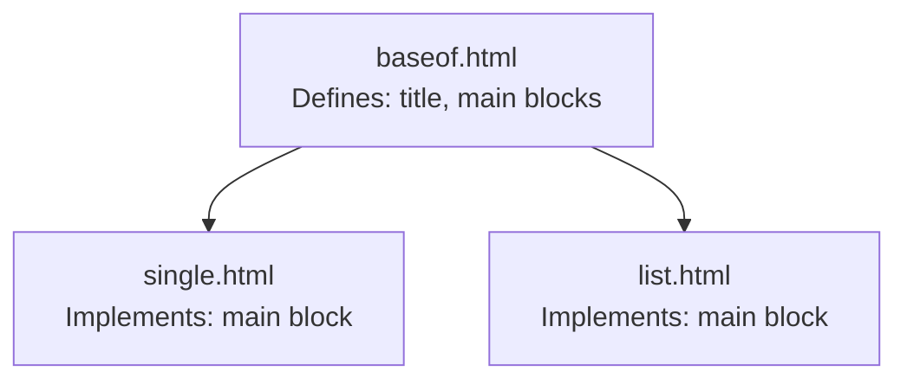
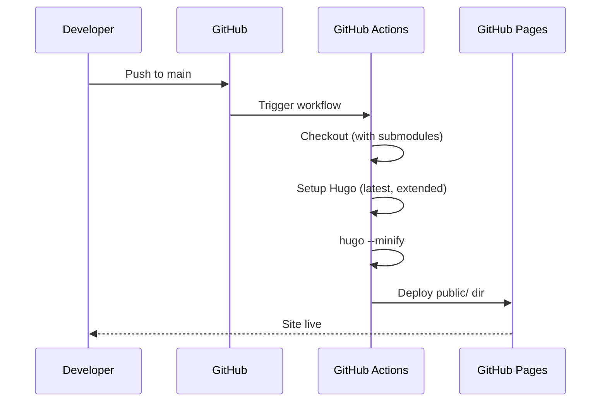

# Interfaces

## Hugo Template Interfaces

### Block System

The site uses Hugo's block/define template inheritance:



- `baseof.html` defines `{{ block "title" }}` and `{{ block "main" }}` placeholders
- `single.html` and `list.html` implement `{{ define "main" }}` to inject content

### Shortcode Interface

Shortcodes are invoked from Markdown content:

```text


```

### Hugo Pipes CSS Pipeline

CSS processing chain defined in `baseof.html`:

1. `resources.Get` — loads each CSS module from `assets/css/`
2. `resources.Concat` — merges into single `css/style.css`
3. `minify` — removes whitespace
4. `fingerprint` — adds content hash for cache busting

Output: `<link>` tag with `integrity` attribute (SRI hash).

## Configuration Interface

### `config.toml`

| Key | Value | Purpose |
|---|---|---|
| `baseURL` | `https://abrahamsustaita.com/` | Site root URL |
| `languageCode` | `en-us` | Language |
| `title` | `abrahamsustaita.com` | Site title |
| `params.contentTypeName` | `posts` | Default content section |
| `params.description` | Terminal-style technical blog | Meta description |
| `params.enableGitInfo` | `true` | Git-based last modified dates |
| `markup.highlight.*` | Monokai style, line numbers | Code block rendering |

### `theme.toml`

Theme metadata — name, description, tags, min Hugo version. Not consumed at runtime; serves as theme documentation.

## Deployment Interface

### GitHub Actions Workflow (`.github/workflows/gh-pages.yml`)

Trigger: push to `main` or pull request.



Steps:

1. Checkout with submodules and full history (`actions/checkout@v4`)
2. Install Hugo extended (latest) (`peaceiris/actions-hugo@v2`)
3. Install Node.js 20 (`actions/setup-node@v4`)
4. `npm install` (PostCSS/Autoprefixer dependencies)
5. `hugo --minify`
6. Deploy `./public` to GitHub Pages (only on `main`, not PRs)

Runner: `ubuntu-latest`

Every push to `main` triggers a build and deploy, so changes go live
within minutes of pushing. PRs trigger the build but not the deploy.
