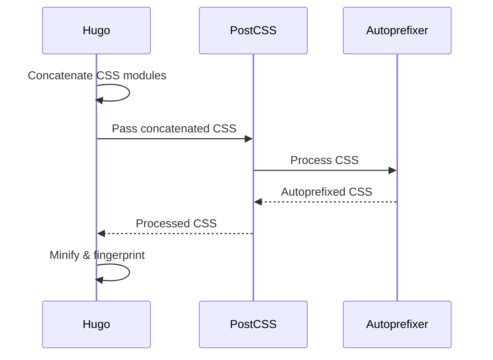
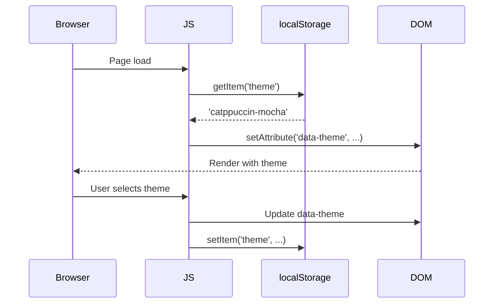
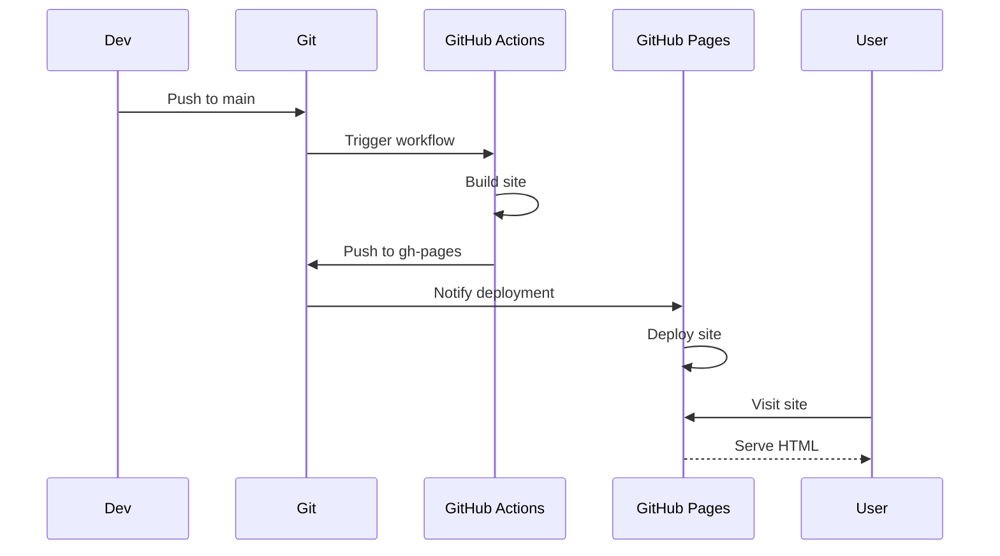

# Interfaces

## Overview

This document describes the interfaces, APIs, and integration points in the abrahamsustaita.com codebase. Since this is a static site, there are no traditional REST APIs or backend services. Instead, interfaces consist of:

1. **Configuration Interfaces** - File formats and schemas
2. **Template Interfaces** - Hugo template contracts
3. **Shortcode Interfaces** - Reusable content component APIs
4. **Browser APIs** - JavaScript interactions with browser features
5. **Build Interfaces** - Hugo Pipes and PostCSS integration
6. **Deployment Interfaces** - GitHub Actions and GitHub Pages

## Configuration Interfaces

### config.toml

**Purpose:** Hugo site configuration

**Schema:**

```toml
baseURL = 'string'           # Site URL
languageCode = 'string'      # Language code (e.g., 'en-us')
title = 'string'             # Site title

[params]
  contentTypeName = 'string'  # Content type name
  description = 'string'      # Site description
  enableGitInfo = boolean     # Enable Git info
  favicon = 'string'          # Favicon path
  fullWidthTheme = boolean    # Full-width layout
  showLastUpdated = boolean   # Show last updated date

[markup]
  [markup.highlight]
    lineNos = boolean         # Show line numbers
    lineNumbersInTable = boolean  # Line numbers in table
    noClasses = boolean       # Use inline styles
    style = 'string'          # Syntax highlighting style
    tabWidth = integer        # Tab width
```

**Example:**

```toml
baseURL = 'https://abrahamsustaita.com/'
languageCode = 'en-us'
title = 'abrahamsustaita.com'

[params]
  contentTypeName = "posts"
  description = "A terminal-style technical blog"
  enableGitInfo = true
  favicon = "favicon.ico"
  fullWidthTheme = true
  showLastUpdated = false

[markup]
  [markup.highlight]
    lineNos = true
    lineNumbersInTable = false
    noClasses = false
    style = "monokai"
    tabWidth = 4
```

### theme.toml

**Purpose:** Theme metadata

**Schema:**

```toml
name = 'string'              # Theme name
license = 'string'           # License type
licenselink = 'string'       # License URL
description = 'string'       # Theme description
homepage = 'string'          # Theme homepage
tags = ['string']            # Theme tags
features = ['string']        # Theme features
min_version = 'string'       # Minimum Hugo version

[author]
  name = 'string'            # Author name
  homepage = 'string'        # Author homepage
```

### package.json

**Purpose:** Node.js dependencies for PostCSS

**Schema:**

```json
{
  "devDependencies": {
    "autoprefixer": "string",   // Version constraint
    "postcss": "string",        // Version constraint
    "postcss-cli": "string"     // Version constraint
  }
}
```

### postcss.config.js

**Purpose:** PostCSS configuration

**Schema:**

```javascript
module.exports = {
  plugins: [
    require('autoprefixer')  // Plugin list
  ]
}
```

## Template Interfaces

### Hugo Template Contract

All templates must follow Hugo's template syntax and conventions.

#### Base Template Interface

**File:** `layouts/_default/baseof.html`

**Contract:**

- MUST define `{{ block "main" . }}` placeholder
- MUST define `{{ block "title" . }}` placeholder (optional)
- SHOULD include site header and footer
- SHOULD load CSS and JS assets

#### Child Template Interface

**Files:** `single.html`, `list.html`, `index.html`, etc.

**Contract:**

- MUST implement `{{ define "main" }}...{{ end }}`
- MAY implement `{{ define "title" }}...{{ end }}`
- MUST use `.` context variable for page data

**Available Context Variables:**

```go
.Title           // Page title
.Content         // Rendered Markdown content
.Date            // Page date
.Params          // Front matter parameters
.File.BaseFileName  // Filename without extension
.RelPermalink    // Relative URL
.Section         // Section name
.Pages           // List of pages (for list templates)
.Site            // Site configuration
```

### Shortcode Interfaces

#### image Shortcode

**File:** `layouts/shortcodes/image.html`

**API:**

```markdown

```

**Parameters:**

| Parameter | Type | Required | Default | Description |
|-----------|------|----------|---------|-------------|
| `src` | string | Yes | - | Image filename (resolved from `/static/`) |
| `alt` | string | Yes | - | Alt text for accessibility |
| `caption` | string | No | - | Optional image caption |
| `loading` | string | No | "lazy" | "lazy" or "eager" |

**Example:**

```markdown

```

**Output:**

```html
<figure class="terminal-image">
  
  <figcaption>My terminal setup</figcaption>
</figure>
```

#### image-grid Shortcode

**File:** `layouts/shortcodes/image-grid.html`

**API:**

```markdown

```

**Parameters:**

| Parameter | Type | Required | Default | Description |
|-----------|------|----------|---------|-------------|
| `images` | string | Yes | - | Comma-separated list of image filenames |

**Example:**

```markdown

```

**Output:**

```html
<div class="image-grid">
  
  
  
</div>
```

## Front Matter Interface

### Content File Front Matter

**Format:** YAML

**Schema:**

```yaml
title: string        # Required - Post title
date: datetime       # Required - Publication date (YYYY-MM-DDTHH:MM:SS-TZ)
draft: boolean       # Optional - Draft status (default: false)
tags: [string]       # Optional - List of tags
```

**Example:**

```yaml
---
title: "WezTerm: Project-Based Workspaces"
date: 2024-09-04T19:34:00-05:00
draft: false
tags: ["wezterm", "terminal", "productivity"]
---
```

**Validation Rules:**

- `title` MUST be a non-empty string
- `date` MUST be in ISO 8601 format
- `draft` MUST be boolean (if present)
- `tags` MUST be an array of strings (if present)

## Browser APIs

### localStorage API

**Purpose:** Persist theme selection across sessions

**Interface:**

```javascript
// Read theme
var theme = localStorage.getItem('theme');  // Returns string | null

// Write theme
localStorage.setItem('theme', 'rose-pine');  // Returns void

// Error handling
try {
  localStorage.setItem('theme', theme);
} catch (e) {
  // Handle private browsing or quota exceeded
}
```

**Storage Schema:**

```javascript
{
  "theme": "rose-pine" | "catppuccin-mocha" | ... // One of 13 theme names
}
```

### DOM API

**Purpose:** Manipulate theme attribute and dropdown

**Interface:**

```javascript
// Get theme dropdown
var select = document.getElementById('theme-select');  // Returns HTMLSelectElement | null

// Set data-theme attribute
document.documentElement.setAttribute('data-theme', 'rose-pine');  // Returns void

// Listen for dropdown changes
select.addEventListener('change', function() {
  var theme = this.value;  // string
  // Handle theme change
});
```

## Build Interfaces

### Hugo Pipes Interface

**Purpose:** Asset processing pipeline

**CSS Pipeline:**

```go
{{ $variables := resources.Get "css/variables.css" }}
{{ $base := resources.Get "css/base.css" }}
// ... more modules

{{ $css := slice $variables $base ... | resources.Concat "css/style.css" | minify | fingerprint }}
<link rel="stylesheet" href="{{ $css.RelPermalink }}" integrity="{{ $css.Data.Integrity }}">
```

**Methods:**

- `resources.Get "path"` - Load asset from `assets/` directory
- `resources.Concat "output"` - Concatenate multiple resources
- `minify` - Minify CSS/JS
- `fingerprint` - Generate cache-busting hash

**Output:**

- `.RelPermalink` - Relative URL with fingerprint (e.g., `/css/style.abc123.css`)
- `.Data.Integrity` - SRI hash (e.g., `sha256-abc123...`)

**JS Pipeline:**

```go
{{ $js := resources.Get "js/script.js" | minify | fingerprint }}
<script src="{{ $js.RelPermalink }}" defer></script>
```

### PostCSS Interface

**Purpose:** CSS processing and vendor prefixing

**Configuration:**

```javascript
// postcss.config.js
module.exports = {
  plugins: [
    require('autoprefixer')
  ]
}
```

**Input:** Concatenated CSS from Hugo Pipes

**Output:** Autoprefixed CSS

**Example Transformation:**

```css
/* Input */
.element {
  display: flex;
  user-select: none;
}

/* Output */
.element {
  display: -webkit-box;
  display: -ms-flexbox;
  display: flex;
  -webkit-user-select: none;
     -moz-user-select: none;
      -ms-user-select: none;
          user-select: none;
}
```

## Deployment Interfaces

### GitHub Actions Workflow Interface

**File:** `.github/workflows/gh-pages.yml`

**Triggers:**

```yaml
on:
  push:
    branches:
      - main      # Deploy on push to main
  pull_request:   # Build (but don't deploy) on PRs
```

**Jobs:**

```yaml
jobs:
  deploy:
    runs-on: ubuntu-latest
    steps:
      - uses: actions/checkout@v4
      - uses: peaceiris/actions-hugo@v2
      - uses: actions/setup-node@v4
      - run: npm install
      - run: hugo --minify
      - uses: peaceiris/actions-gh-pages@v3
```

**Inputs:**

- Source code from repository
- `secrets.GITHUB_TOKEN` (automatically provided)

**Outputs:**

- Built site in `public/` directory
- Deployed to `gh-pages` branch

### GitHub Pages Interface

**Configuration:**

- **Source Branch:** `gh-pages`
- **Source Directory:** `/` (root)
- **Custom Domain:** `abrahamsustaita.com`
- **HTTPS:** Enforced

**Deployment Process:**

1. GitHub Actions pushes to `gh-pages` branch
2. GitHub Pages detects change
3. Site is deployed to `https://abrahamsustaita.com/`
4. DNS resolves custom domain to GitHub Pages

## CSS Custom Properties Interface

### Theme Interface

**Purpose:** Define color tokens for theming

**Contract:**

Each theme MUST define all 12 color tokens:

```css
:root[data-theme="theme-name"] {
  --base: #hexcolor;      /* Page background */
  --surface: #hexcolor;   /* Elevated backgrounds */
  --overlay: #hexcolor;   /* Borders, highlights */
  --text: #hexcolor;      /* Body text */
  --subtle: #hexcolor;    /* Secondary text */
  --muted: #hexcolor;     /* Muted text */
  --love: #hexcolor;      /* Errors, red accent */
  --gold: #hexcolor;      /* Warnings, types */
  --rose: #hexcolor;      /* Hover, inline code */
  --pine: #hexcolor;      /* Prompts, operators */
  --foam: #hexcolor;      /* Links, strings */
  --iris: #hexcolor;      /* Headings, keywords */
}
```

**Usage:**

```css
/* Consume tokens in other CSS modules */
body {
  background: var(--base);
  color: var(--text);
}

a {
  color: var(--foam);
}

a:hover {
  color: var(--rose);
}
```

## Integration Points

### Hugo ↔ PostCSS



### Browser ↔ localStorage



### GitHub Actions ↔ GitHub Pages



## Error Handling

### localStorage Errors

**Scenario:** Private browsing or quota exceeded

**Handling:**

```javascript
try {
  localStorage.setItem('theme', theme);
} catch (e) {
  // Silently fail - theme will reset on page reload
  // Could add fallback to cookies or sessionStorage
}
```

### Missing DOM Elements

**Scenario:** Theme dropdown not found

**Handling:**

```javascript
var select = document.getElementById('theme-select');
if (!select) return;  // Exit early if element missing
```

### Build Failures

**Scenario:** Hugo build fails

**Handling:**

- GitHub Actions workflow fails
- No deployment occurs
- Developer notified via email
- Previous version remains live

## API Versioning

### Hugo Template API

- **Current Version:** Hugo v0.157.0
- **Minimum Version:** Hugo v0.80.0
- **Breaking Changes:** None expected (Hugo maintains backward compatibility)

### Browser APIs

- **localStorage:** Stable API, supported in all modern browsers
- **DOM API:** Stable API, no version concerns

### GitHub Actions

- **actions/checkout:** v4 (auto-updates to latest v4.x)
- **peaceiris/actions-hugo:** v2 (auto-updates to latest v2.x)
- **actions/setup-node:** v4 (auto-updates to latest v4.x)
- **peaceiris/actions-gh-pages:** v3 (auto-updates to latest v3.x)

## Testing Interfaces

### Manual Testing

**Template Testing:**

```bash
hugo server  # Test templates with live reload
```

**Build Testing:**

```bash
hugo --minify  # Test production build
```

**Theme Testing:**

1. Open site in browser
2. Select each theme from dropdown
3. Verify colors update correctly
4. Reload page and verify theme persists

### Automated Testing

**GitHub Actions:**

- Automatically tests build on every push
- Fails if Hugo build fails
- Prevents broken deployments

## Future Interface Considerations

### Potential Additions

1. **Comments API** - Utterances or Giscus integration
2. **Search API** - Lunr.js or Algolia integration
3. **Analytics API** - Plausible or Fathom integration
4. **RSS Feed** - Hugo's built-in RSS generation
5. **Sitemap** - Hugo's built-in sitemap generation

### Backward Compatibility

- All interfaces SHOULD maintain backward compatibility
- Breaking changes MUST be documented in AGENTS.md
- Configuration changes SHOULD provide migration guides
