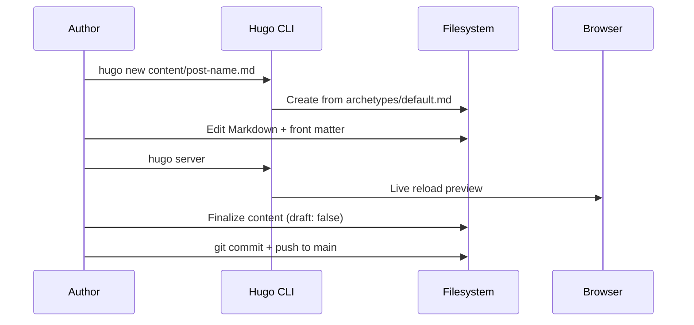
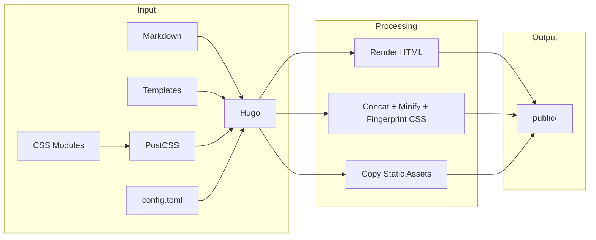
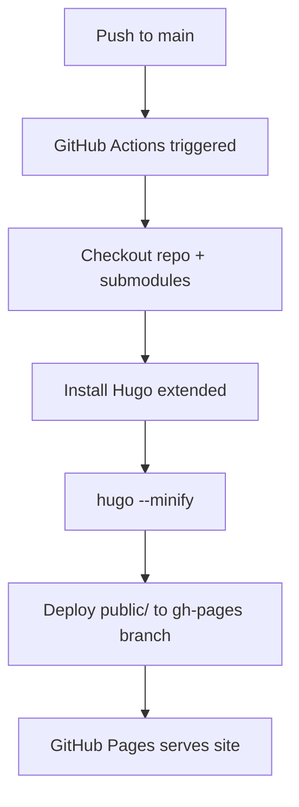

# Workflows

## Content Authoring Workflow



### Steps

1. Create new post: `hugo new content/topic.sequence.subtitle.md`
2. Edit the generated file — set `draft: false` when ready
3. Preview locally: `hugo server` (live reload)
4. Commit and push to `main` to trigger deployment

## Build Workflow



### Local Build

```bash
hugo --minify
```

### Local Development Server

```bash
hugo server
```

## Deployment Workflow



Triggered automatically on push to `main`. Pull requests trigger the build but not the deploy step.

## Adding Images Workflow

1. Place image file in `static/img/` (or as a page resource alongside the content file)
2. Reference in Markdown using the `image` shortcode:

    ```text
    
    ```

3. For multiple images, use the `image-grid` shortcode:

    ```text
    
    ```

## CSS Modification Workflow

1. Edit the relevant module in `assets/css/` (e.g., `typography.css`)
2. Hugo Pipes automatically picks up changes during `hugo server`
3. The pipeline concatenates, minifies, and fingerprints the output
4. No manual build step needed for CSS — Hugo handles it

## Adding a New CSS Module

1. Create `assets/css/newmodule.css`
2. Add `@import "newmodule.css";` to `assets/css/main.css`
3. Add `{{ $newmodule := resources.Get "css/newmodule.css" }}` in `baseof.html`
4. Add `$newmodule` to the `slice` in the `resources.Concat` call
